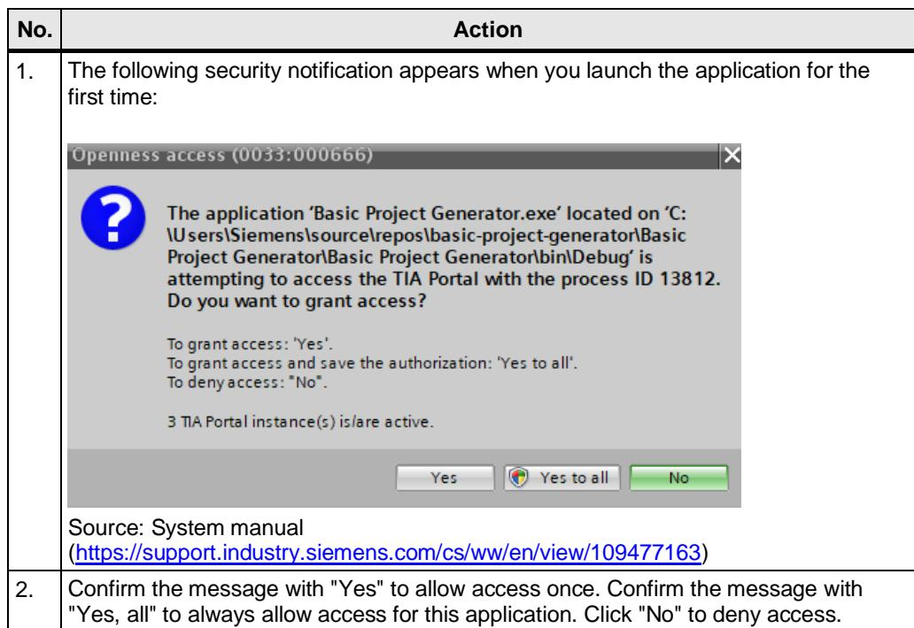

# 4 创建一个新的 TIA Portal Openness 应用程序

## 4.1 TIA Portal V17.0

安装 TIA Portal V17.0。

!!! note
在 STEP 7 V17.0 或 WinCC V17.0 中，TIA Portal Openness V17.0 包含在交付范围内，并默认随其一同安装。

## 4.2 管理用户权限

要使用和/或创建 TIA Portal Openness 应用程序，必须将该用户添加到“Siemens TIA Openness”用户组中。

表 4-1

## 4.3 创建项目

表 4-2

| 编号 | 操作 |
|------|------|
| 1. | 创建一个新项目（例如在 Microsoft Visual Studio 中）。 |
| 2. | 创建对 Openness DLL（Siemens.Engineering.dll 和 Siemens.Engineering.HMI.dll）的引用。 它们位于 TIA Portal 安装目录下的“... > Siemens > Automation > Portal V17_0 > PublicAPI > V17.0”中。 |
| 3. | 将这两个 DLL 的“Copy Local”属性设置为“False”。 |
|  | 基本项目生成器属性引用分析器Siemens.EngineeringSystem |
|  | 属性 Siemens.Engineering 引用属性 |
|  | (名称) Siemens.Engineering 别名 global 复制到本地 False 文化 描述 构建原因： 手动、变更集 嵌入互操作类型 False 文件类型 程序集标识 Siemens.Engineering 路径 C:\Program Files\Siemens\AutonResolved True 运行时版本 v4.0.30319 特定版本 False 强名称 True 版本 17.0.0.0 |

## 4.4 配置文件 / AssemblyResolve

要查找 Openness DLL 的路径，您可以使用配置文件或“AssemblyResolve”事件。

表4-3

| 编号 | 操作 |
|------|------|
| 1. | 配置文件：如果您在安装 STEP 7 V17.0 或 WinCC V17.0 (TIA Portal) 时选择了与默认路径不同的路径，请在配置文件中将默认路径替换为您实际的安装路径。请在与 Openness 应用程序相同的目录下创建应用程序配置文件。 |
| 2. | AssemblyResolve要建立与 TIA Portal 的连接，可以使用 Resolver.GetAssemblyPath 方法。该方法会从注册表中读取 TIA Portal 的安装路径，从而使程序能够独立于安装路径运行。 |

## 4.5 授予访问权限

表 4-4

如果您正在使用 Microsoft Visual Studio，即使您已经点击了“全部是”，仍可能会收到该提示

!!! note
如果您正在使用 Microsoft Visual Studio，即使您已经点击了"全部是"，仍可能会收到该安全提示。请按照第 5 章所引用的文章中的说明操作，以避免出现这种情况。

