# 5 基础项目生成器

## 5.1 概述

“基础项目生成器”程序旨在帮助您开始编写您的第一个 Openness 应用程序。

您可以在“BasicProjectGenerator\_Appl.zip”中的下载包“108716692\_TIA\_PortalOpenness\_GettingStarted\_V17.zip”内找到一个已完全编译的“exe”文件。

!!! note
    您可以在下载包"108716692_TIA_PortalOpenness_GettingStarted_V17.zip"中的"BasicProjectGenerator_Appl.zip"内找到一个已完全编译的"exe"文件。

图 5-1
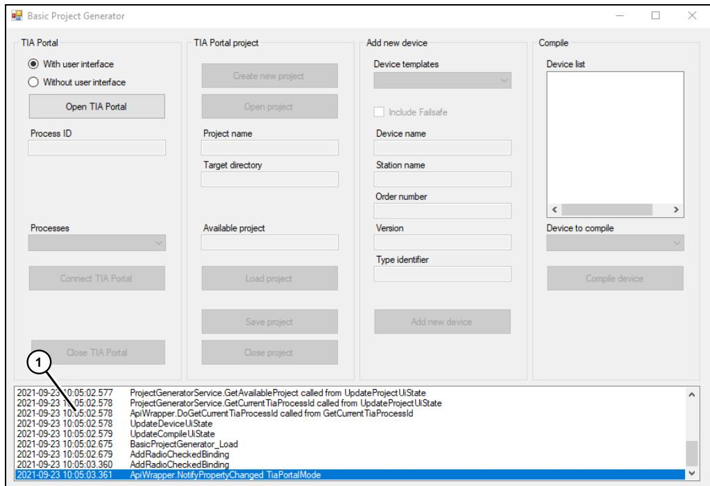{ #fig-5-1 }

程序序列的状态信息显示在列表框中。当前状态以蓝色高亮显示。

图5-2
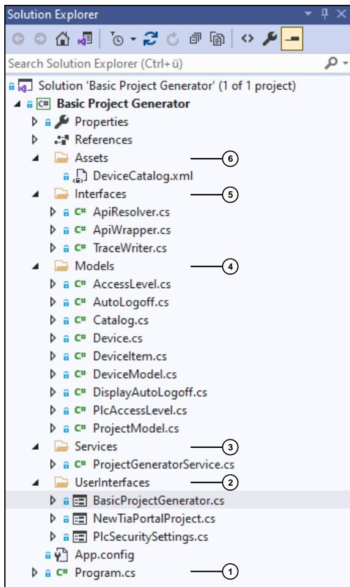{ #fig-5-2 }

表 5-2
<table><tr><td>编号</td><td>描述</td></tr><tr><td>1.</td><td>Program.cs 文件包含 Main 函数，作为应用程序的入口点。</td></tr><tr><td>2.</td><td>BasicProjectGenerator.cs 作为应用程序的主视图（参见图 5-1），包含所有控件以及这些控件的事件处理程序的实现。NewTiaPortalProject.cs 是一个用于创建新项目的对话框视图。PlcSecuritySettings.cs 是用于在创建新设备时添加安全设置的对话框视图。</td></tr><tr><td>3.</td><td>ProjectGeneratorService.cs 是用户界面（参见本表第 2 项）与 TIA Portal Openness API（参见本表第 5 项）之间的接口。</td></tr><tr><td>4.</td><td>所有数据对象都在“模型”区域中定义。 详细说明（如有必要）可在相关章节中找到。</td></tr><tr><td>5.</td><td>在“接口”区域中，您可以找到以 ApiWrapper.cs 形式实现的 TIA Portal Openness API 访问逻辑，以及整个应用程序中使用的接口/服务。ApiWrapper.cs 是唯一包含对“Siemens.Engineering.dll”引用。所有 API 函数调用在 ApiWrapper 类中均按主题分组到不同区域中。</td></tr><tr><td>6.</td><td>DeviceCatalog.xml 是一个模板文件，提供有关添加新设备的元信息。 可以随时将新设备添加到此设备目录中。在创建或打开项目时，系统会重新加载设备目录。这是通过调用 ProjectGeneratorService 类中的 LoadDeviceCatalog 方法来实现的。</td></tr>

</table>

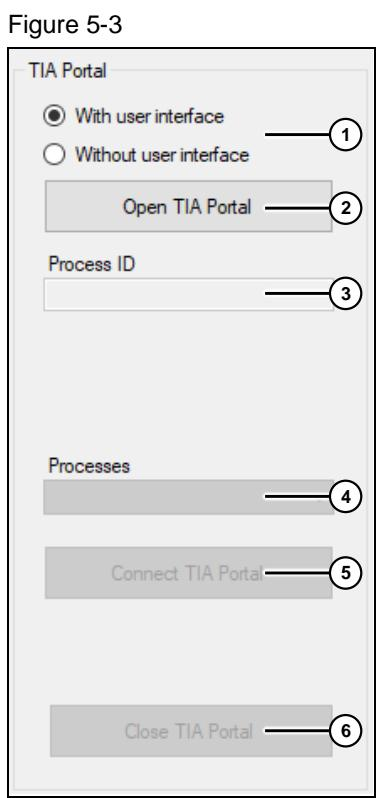

<table><tr><td>编号</td><td>说明</td></tr><tr><td>1.</td><td>若要创建新的 TIA Portal 项目，请单击“创建新项目”按钮，并按照表 5-4 中的说明操作。 首先，调用 ProjectGeneratorService 类中的 CreateNewProject 方法，以输入项目名称和目标目录。然后，系统调用 ApiWrapper 类中的 DoCreateNewProject 方法。</td></tr><tr><td>2.</td><td>若要打开现有的 TIA Portal 项目，请单击“打开项目”按钮，并按照表 5-5 中的说明操作。系统将调用 ApiWrapper 类中的 DoOpenProject 方法。</td></tr><tr><td>3.</td><td>打开的项目名称将作为信息显示在“项目名称”文本框中。</td></tr><tr><td>4.</td><td>打开的项目文件路径将作为信息显示在“目标目录”文本框中。</td></tr><tr><td>5.</td><td>如果已与正在运行的 TIA Portal 实例建立了连接，且该实例中已包含一个打开的项目，则项目名称将显示在“可用项目”文本框中，“加载项目”按钮将自动启用。</td></tr><tr><td>6.</td><td>若要显示或编辑可用项目（参见第 5 项）中的项目数据，请单击“加载项目”按钮。 在 ApiWrapper 类中调用了 DoLoadProject 方法。</td></tr><tr><td>7.</td><td>如果您对项目进行了更改，“保存项目”按钮将自动启用。单击“保存项目”按钮将保存对项目的所有更改。 ApiWrapper 类中会调用 DoSaveProject 方法。</td></tr><tr><td>8.</td><td>单击“关闭项目”按钮可关闭当前打开的项目。系统将检查该项目是否已被修改。如果已修改，则必须在关闭前做出决定（参见[图 5-8](#fig-5-8)）。 此时，请按照表 5-6 中的说明操作。在 ApiWrapper 类中调用了 DoCloseProject 方法。</td></tr></table>
<table><tr><td>编号</td><td>说明</td></tr><tr><td>1.</td><td>使用”带用户界面”和”不带用户界面”单选按钮，选择是否以带用户界面或不带用户界面的方式启动 TIA Portal。 在 BasicProjectGenerator_Load 方法中，这些单选按钮与 ApiWrapper 类的 TiaPortalMode 属性相关联。它们被赋值为选中相应选项时必须设置的值。</td></tr><tr><td>2.</td><td>要打开 TIA Portal 的实例，请单击“打开 TIA Portal”按钮。ApiWrapper 类的 DoOpenTiaPortal 方法会创建一个新实例，并将其赋值给 ApiWrapper 类的 TiaPortal 属性。由于 TiaPortalMode 属性与单选按钮相关联（参见第 1 项），因此将自动采用所选的启动模式。TiaPortal = new TiaPortal(TiaPortalMode);</td></tr><tr><td>3.</td><td>创建 TIA Portal 实例后，该实例的进程 ID 将作为信息显示在文本框中（参见图 5-7）。</td></tr><tr><td>4.</td><td>应用程序启动后，将检测到所有 TIA Portal 实例，并将其与 TIA Portal 模式信息一起以列表形式显示在组合框中（参见图 5-7）。 一旦选中的进程 ID 与第 3 项中的进程 ID 不同，“连接 TIA Portal”按钮将自动激活。</td></tr><tr><td>5.</td><td>单击“连接 TIA Portal”按钮，与 TIA Portal 实例建立连接。 将调用 ApiWrapper 类中的 DoConnectTiaPortal 方法。第 3 项中的文本字段信息将更新为已连接实例的进程 ID。</td></tr><tr><td>6.</td><td>单击“关闭 TIA Portal”按钮以关闭 TIA Portal 实例。 在 ApiWrapper 类中，将调用 DoCloseTiaPortal 方法。在此过程中，所有仍处于打开状态的项目都将被关闭。如果项目中包含未保存的更改，系统将提示您选择一个选项（参见[图 5-8](#fig-5-8)）。</td></tr></table>

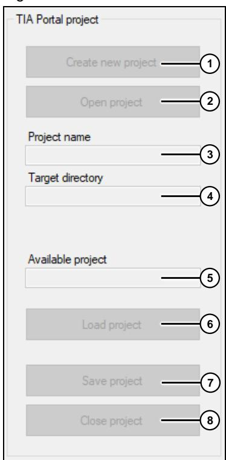
图5-4
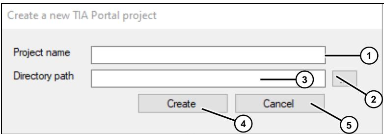{ #fig-5-4 }

表 5-3

表 5-4
<table><tr><td>编号</td><td>说明</td></tr><tr><td>1.</td><td>为新项目输入名称。 名称必须符合 Windows 的文件命名规则。</td></tr><tr><td>2.</td><td>打开”文件资源管理器”，并选择将要创建新项目的目标目录。</td></tr><tr><td>3.</td><td>所选目录路径会显示在文本框中，如有需要，可在此处进行编辑。</td></tr><tr><td>4.</td><td>单击”创建”按钮以创建新项目。 通过调用ValidationProvider，系统将首先验证您的输入；如果有效，对话框将关闭，并创建新项目。</td></tr><tr><td>5.</td><td>如果您想中止该过程，请单击”取消”按钮。</td></tr></table>

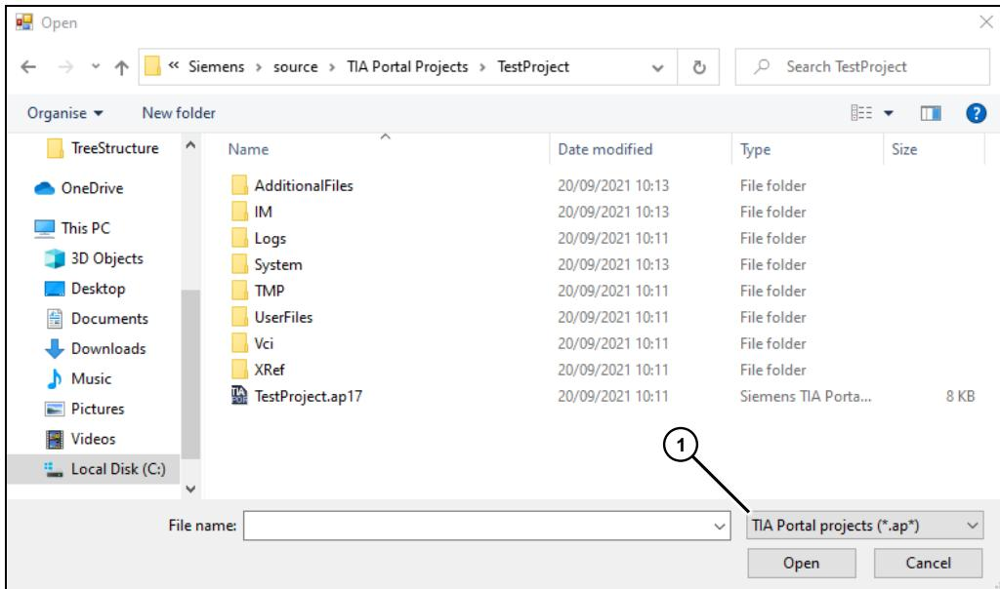

表 5-5
<table><tr><td>编号</td><td>描述</td></tr><tr><td>1.</td><td>项目文件的文件过滤器设置为 *.ap，因此所有项目版本都会显示出来。请确保加载正确的版本。</td></tr></table>

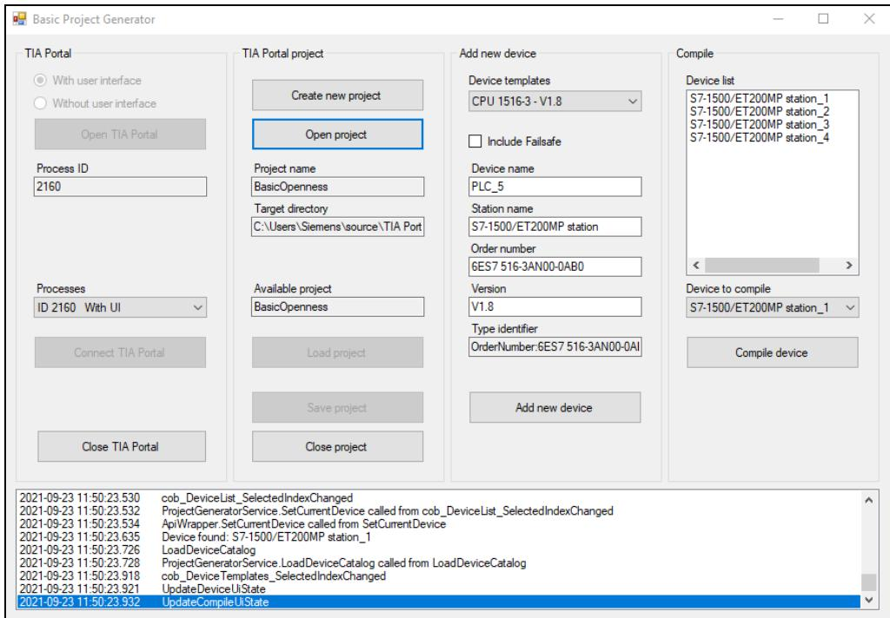
图5-6
图5-7
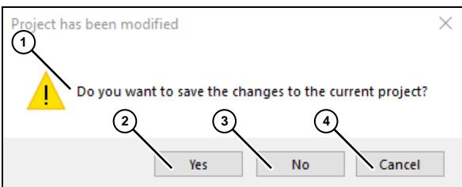{ #fig-5-7 }
<table

><tr><td>编号</td><td>说明</td></tr><tr><td>1.</td><td>消息框（参见[图 5-8](#fig-5-8)）将提示您决定如何处理对项目的更改。</td></tr><tr><td>2.</td><td>要保存更改并关闭项目，请单击“是”。</td></tr><tr><td>3.</td><td>单击“否”可在不保存的情况下关闭项目。</td></tr><tr><td>4.</td><td>单击“取消”以中止“关闭过程”。</td></tr></table>
图5-8
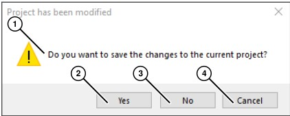{ #fig-5-8 }

## 5.4 “添加新设备”组

图 5-9
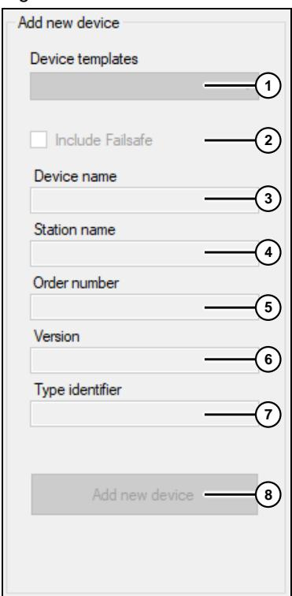{ #fig-5-9 }

<table><tr><td>编号</td><td>说明</td></tr><tr><td>1.</td><td>创建新项目或打开现有项目时，将加载设备目录（参见表 5-1 第 6 项），并作为设备列表显示在组合框中（参见图 5-10）。</td></tr><tr><td>2.</td><td>设备目录提供“包含故障安全”元数据，在从列表中选择设备模板时，该元数据会被启用或禁用。这取决于模板的配置方式。 如果启用了“包含故障安全”选项，则在“安全设置”对话框中将可选择“访问级别：完全访问，包括故障安全（无保护）”。否则，该访问级别将不存在。</td></tr><tr><td>3.</td><td>来自模板的设备名称。</td></tr><tr><td>4.</td><td>来自模板的站名。</td></tr><tr><td>5.</td><td>来自模板的订单号。请务必注意以下说明！</td></tr><tr><td>6.</td><td>此处的版本指固件版本。</td></tr><tr><td>7.</td><td>“类型标识符”是 Device 类中的属性 public string TypeIdentifier =&gt; &quot;OrderNumber:&quot; + OrderNumber + &quot;/&quot; + FirmwareVersion;。 它作为只读信息显示。请务必遵守以下注意事项！</td></tr><tr><td>8.</td><td>单击“添加新设备”按钮以添加新设备。添加新设备后，“安全设置”对话框将自动打开。 系统将提示您输入设置（参见表 5-8）。</td></tr></table>

!!! note
    输入无效的设备信息（如订单号和/或版本号）可能会导致程序错误（参见[图 5-12](#fig-5-12)）。此时，在 ApiWrapper 类中调用 DoAddNewDevice 方法将失败。

    因此，请仅将有效的设备信息添加到设备目录中。

!!! note
    如果您将新设备添加到项目中，随后又中止了安全设置的创建，那么在编译该设备时将会抛出错误，因为安全设置的配置是必须的。

表5-7
图5-10
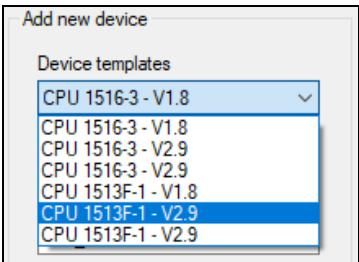{ #fig-5-10 }

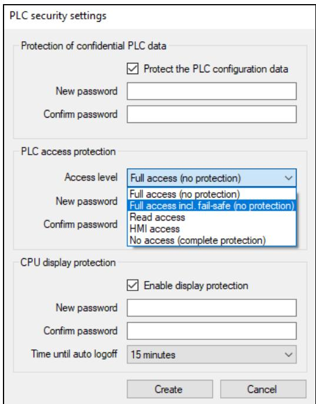

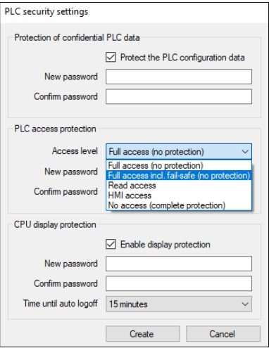{ #fig-5-12 }

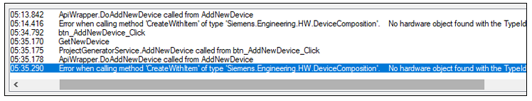

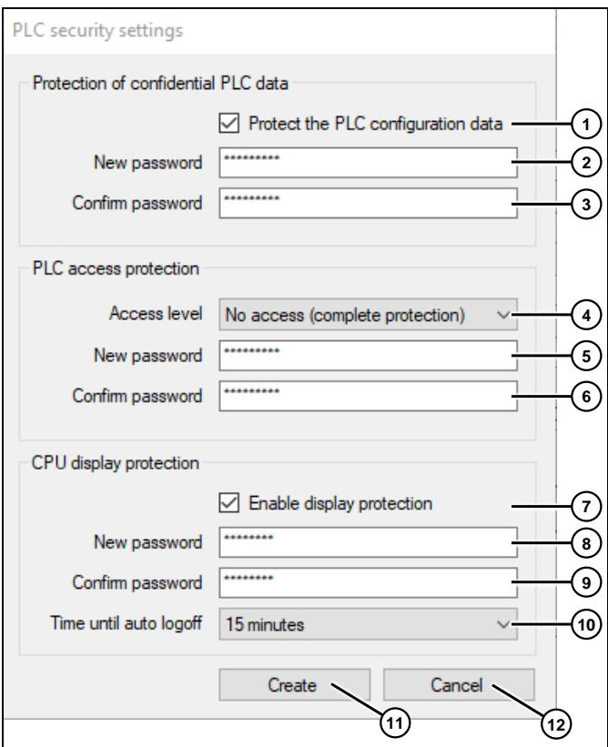

<table><tr><td>编号</td><td>描述</td></tr><tr><td>1.</td><td>启用此选项可通过密码保护对PLC数据的访问。</td></tr><tr><td>2.</td><td>访问PLC配置的密码。密码必须满足以下要求：长度至少为 9 个字符；至少包含一个大写字母；至少包含一个数字；至少包含以下特殊字符之一：@$!%*?&amp;</td></tr><tr><td>3.</td><td>重复输入您输入的密码。</td></tr><tr><td>4.</td><td>选择所需的“访问级别”（参见图 5-11）。</td></tr><tr><td>5.</td><td>PLC 访问级别的密码。密码必须满足以下要求：长度至少为 9 个字符；至少包含一个大写字母；至少包含一个数字；至少包含以下特殊字符之一：@$!%*?&amp;</td></tr><tr><td>6.</td><td>重复输入的密码。</td></tr><tr><td>7.</td><td>启用此选项可对通过显示屏的访问进行密码保护。</td></tr><tr><td>8.</td><td>在显示屏上登录所需的密码。密码必须满足以下要求：长度在 3 到 8 个字符之间；仅允许使用大写字母和数字</td></tr><tr><td>9.</td><td>重复您输入的密码。</td></tr><tr><td>10.</td><td>选择系统在显示屏上自动注销的时间（参见图 5-14）。</td></tr><tr><td>11.</td><td>单击“创建”按钮，为新设备创建安全设置。通过调用 ValidationProvider，系统将首先验证您的输入；若验证通过，对话框将关闭，安全设置将被创建并分配给新设备。</td></tr><tr><td>12.</td><td>如果您希望中止安全设置的创建，请单击“取消”按钮。请注意以下说明！</td></tr></table>

!!! note
    如果您将新设备添加到项目中，随后又中止了安全设置的创建，那么在编译该设备时将会抛出错误，因为安全设置的配置是必须的。

图5-14
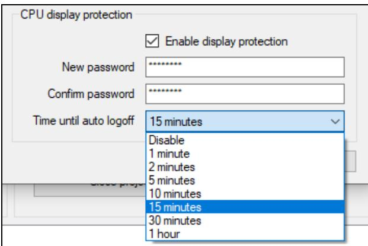{ #fig-5-14 }

## 5.5 “编译”组

图5-15

表 5-9
<table><tr><td>编号</td><td>说明</td></tr><tr><td>1.</td><td>打开的项目中所有设备的列表（另见图 5-16）。</td></tr><tr><td>2.</td><td>用于选择要编译的设备的下拉列表（另见图 5-16）。</td></tr><tr><td>3.</td><td>要开始编译，请单击“编译设备”按钮（另见图 5-16）。</td></tr></table>
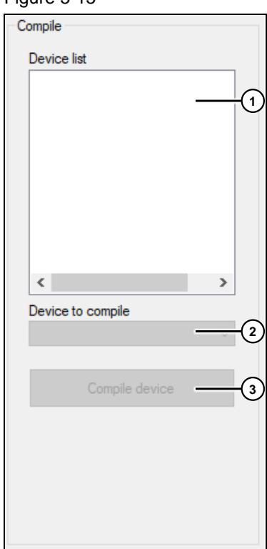
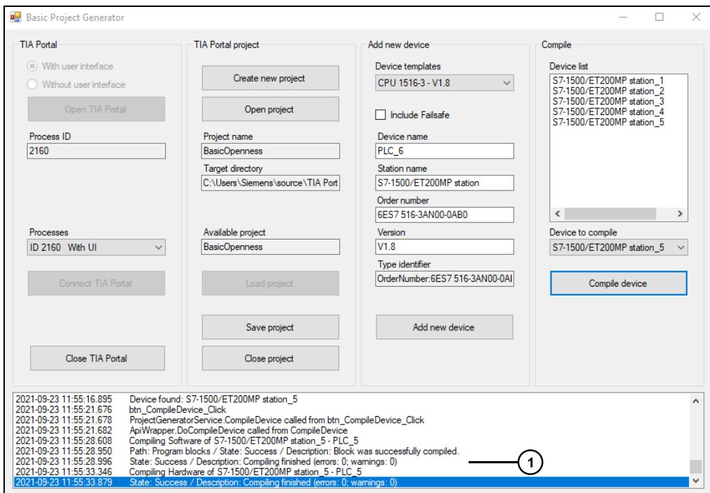

图 5-17

图5-16
<table><tr><td>编号</td><td>说明</td></tr><tr><td>1。</td><td>各个编译子进程的结果将作为状态信息输出。 例如，如果您在安全设置中未指定任何”CPU显示保护”（参见图 5-13），则会发出警告（参见[图 5-17](#fig-5-17)）。</td></tr></table>

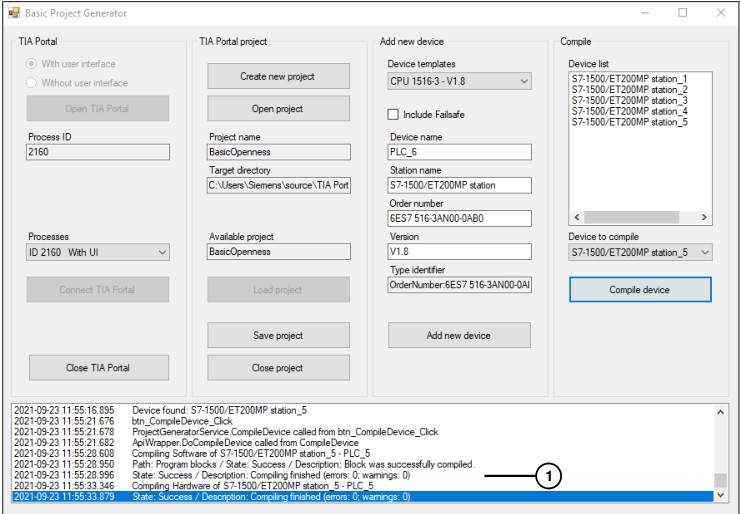
<table><tr><td>41:52.437</td><td>正在编译 S7-1500/ET200MP 站_10 的软件 - PLC_10</td></tr><tr><td>41:52.679</td><td>路径：程序模块 / 状态：信息 / 描述：未编译任何模块。 所有程序块均为最新版本。</td></tr><tr><td>41:52.736</td><td>状态：成功 / 描述： 编译完成（错误：0；警告：0）</td></tr><tr><td>41:53.627</td><td>正在编译 S7-1500/ET200MP 站_10 的硬件 - PLC_10</td></tr><tr><td>41:54.183</td><td>路径：PLC_10 / 状态：警告 / 描述： PLC_10 未配置保护级别</td></tr><tr><td>41:54.269</td><td>路径：CPU display_1 / 状态：警告 / 描述：S7-1500 CPU display 未设置任何密码保护。</td></tr><tr><td>41:54.335</td><td>状态：警告 / 描述：编译完成（错误：0；警告：2）</td></tr><tr><td>&lt;</td><td></td></tr></table>
