### TIA Portal Openness Demo应用程序

## 6.1 概述

在开发“TIAPortalOpennessDemo”应用程序时，采用了模型-视图-视图模型（MVVM）架构模式。 参见图 6-1 和图 6-8。因此，该解决方案由多个项目组成，这些项目按不同区域进行组织（参见图 6-9）。此设计旨在进一步简化您开发自己的 Openness 应用程序的入门过程。关于各个区域和项目的描述，请参见[表 6-4](#table-6-4)。

!!! note
    为了向您展示如何简化针对不同版本的 Openness 应用程序的开发流程，我们开发了这款演示应用程序，使其能够仅通过一个解决方案和一个应用程序，即可开发并支持多个版本的 Siemens.Engineering.dll 以及 Openness API。

    要实现这一点，您必须在需要引用 Siemens.Engineering.dll 的项目中并行引用该库的多个版本。此外，您还必须在此解决方案中的每个项目属性中禁用"自动生成绑定重定向"选项（参见图 6-2，红色框内）。

    关于此情况应如何处理，请参阅表 6-4 第 4 项中的说明。


图 6-1
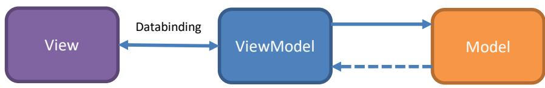{ #fig-6-1 }
呈现与呈现逻辑

为了向您展示如何简化针对不同版本的 Openness 应用程序的开发流程，我们开发了这款演示应用程序，使其能够仅通过一个解决方案和一个应用程序，即可开发并支持多个版本的 Siemens.Engineering.dll 以及 Openness API。

要实现这一点，您必须在需要引用 Siemens.Engineering.dll 的项目中并行引用该库的多个版本。此外，您还必须在此解决方案中的每个项目属性中禁用“自动生成绑定重定向”选项（参见图 6-2，红色框内）。


关于此情况应如何处理，请参阅表6-4第4项中的说明。
图6-2
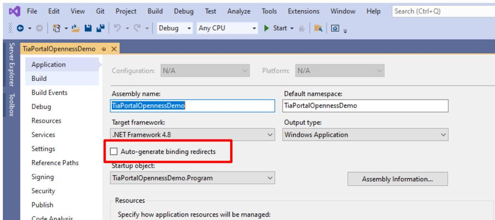{ #fig-6-2 }

## 6.2 配置解决方案

该解决方案包含 Step7、Sinamics Startdrive、WinCC Professional 和 WinCC Unified 模块的相关项目。

如果您未安装这些模块所需的软件，则必须从解决方案中卸载这些项目。

对于无法获取或您不打算支持的特定版本，同样适用上述做法。在这种情况下，也请将相应的目录从项目中移除。

从解决方案或项目中卸载的任何内容都会被保留，并可在以后重新加载。

!!! note
    该解决方案包含 Step7、Sinamics Startdrive、WinCC Professional 和 WinCC Unified 模块的相关项目。

    如果您未安装这些模块所需的软件，则必须从解决方案中卸载这些项目。

    对于无法获取或您不打算支持的特定版本，同样适用上述做法。在这种情况下，也请将相应的目录从项目中移除。


### 6.2.1 卸载项目

图6-3
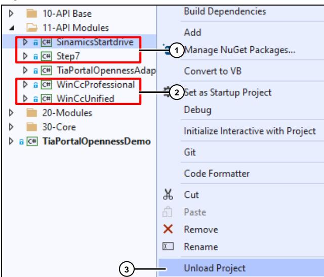{ #fig-6-3 }

表 6-1

<table><tr><td>编号</td><td>说明</td></tr><tr><td>1.</td><td>依赖安装的项目</td></tr><tr><td>2.</td><td>依赖安装的项目</td></tr><tr><td>3.</td><td>使用项目右键菜单将项目从解决方案中卸载。</td></tr></table>

### 6.2.2 重新加载项目

图6-4
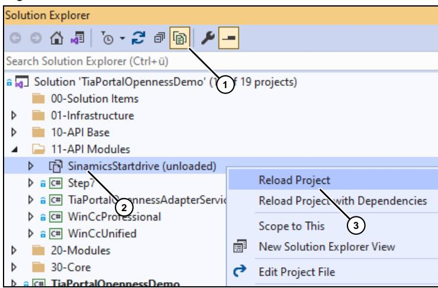{ #fig-6-4 }

表 6-2

<table><tr><td>编号</td><td>说明</td></tr><tr><td>1.</td><td></td></tr><tr><td>2.</td><td>选择要加载的项目。</td></tr><tr><td>3.</td><td>可通过所选项目的右键菜单将该项目加载到解决方案中。</td></tr></table>

### 6.2.3 将项目文件夹从项目中排除

根据您未使用的版本，必须将这些版本的相应实现从项目中排除。为此，请使用包含“从项目中排除”功能的右键菜单（参见图 6-5）。这样您就可以编译项目和/或解决方案。 正因如此，源代码的清晰结构尤为重要。

以下项目包含特定版本的实现：

• TiaPortalOpennessAdapter – 模型 – V…

• SinamicsStartdrive – 服务 – V…

• 第7步 – 服务 – V…

• TiaPortalOpennessAdapterService – 服务 – V…

• WinCcProfessional – 服务 – V…

• WinCcUnified – 服务 – V…

图6-5
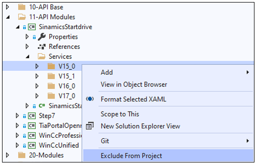{ #fig-6-5 }

### 6.2.4 将项目文件夹添加到项目中

图6-6
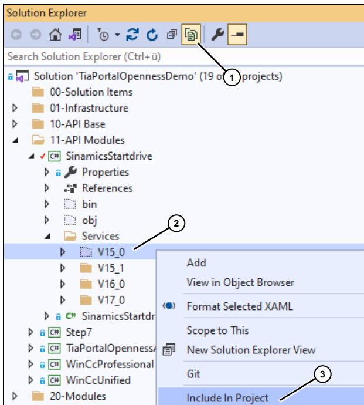{ #fig-6-6 }

表 6-3

<table><tr><td>编号</td><td>说明</td></tr><tr><td>1.</td><td>通过项目”SinamicsStartdrive”的右键菜单激活”显示所有文件”功能。</td></tr><tr><td>2.</td><td>您希望将其包含到项目中的被排除项目文件夹。</td></tr><tr><td>3.</td><td>通过项目文件夹的右键菜单执行”包含到项目中”功能。</td></tr></table>

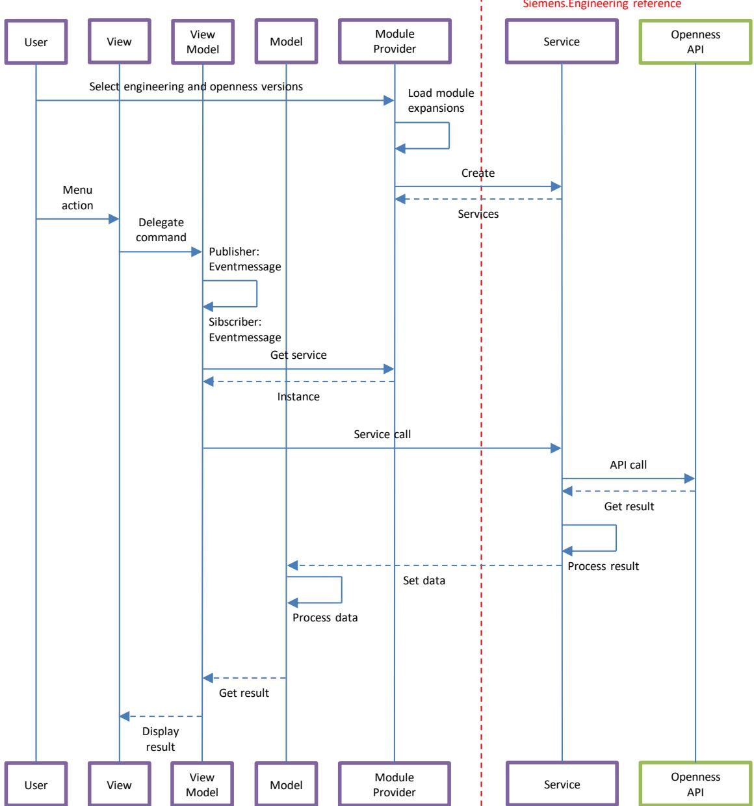

图 6-8
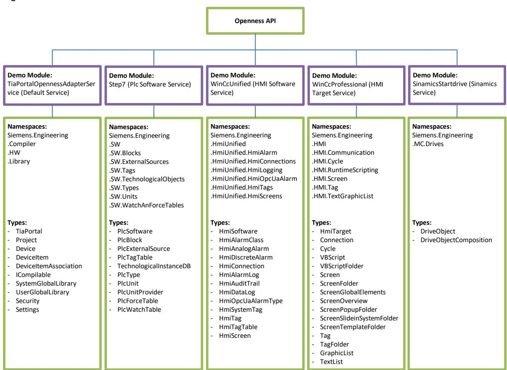{ #fig-6-8 }

概述了 TIAPortalOpennessDemo 应用程序中使用的主要命名空间和类型。

请按照说明，运行程序“TIAPortalOpennessDemo.exe”，然后使用 Microsoft Visual Studio 打开该项目。

您可以在下载包“108716692\_TIA\_PortalOpenness\_Demo\_V17.zip”中找到一个已完全编译的“exe”文件，该下载包位于“TiaPortalOpennessDemo\_Application.zip”内。

!!! note
    您可以在下载包"108716692_TIA_PortalOpenness_Demo_V17.zip"中找到一个已完全编译的"exe"文件，该下载包位于"TiaPortalOpennessDemo_Application.zip"内。


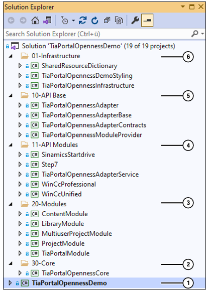


表 6-4
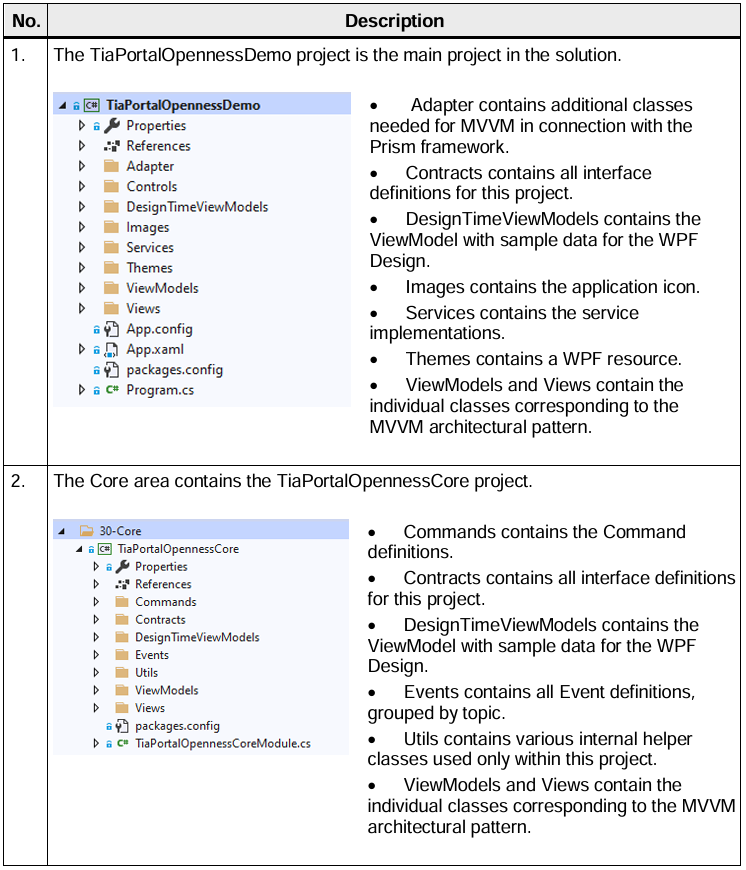{ #table-6-4 }


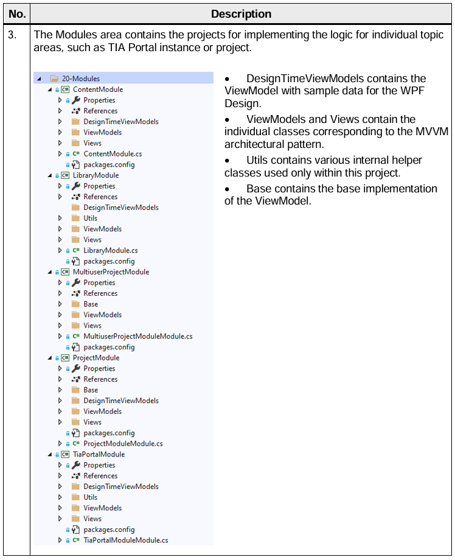


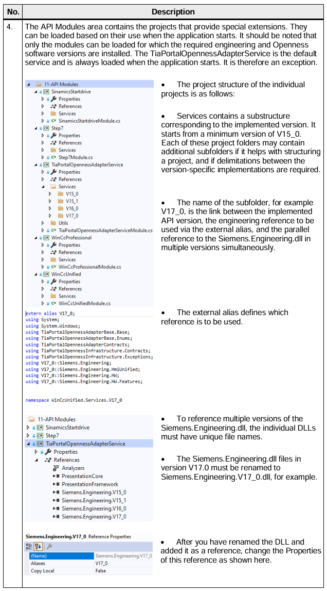

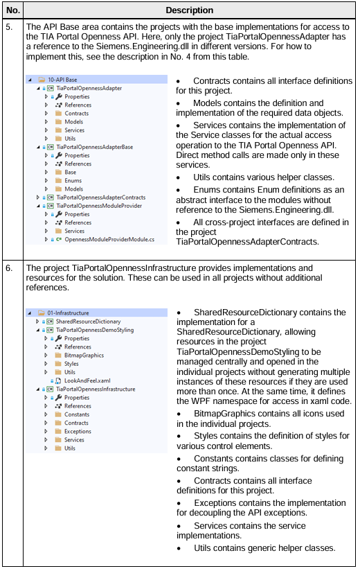


## 6.3 程序集解析

启动应用程序时，您必须选择要使用的 TIA Portal 和 TIA Portal Openness 的版本（参见[图 6-10](#fig-6-10)）。 如果您仅使用一个版本，可以勾选“不再显示此窗口”选项。下次启动应用程序时，所选版本将自动加载。点击“确认”以确认您的选择。

如果您勾选了“不再显示此窗口”复选框，但希望稍后重置该选项以便再次选择版本，可以通过“设置”进行操作（参见“设置”）。

已安装的 TIA Portal 版本是通过 GetEngineeringVersions 方法从注册表中读取的，该方法位于 Utils 项目文件夹中的 TiaPortalOpennessAdapter 项目内的 Resolver 类中。

您可以在项目 TiaPortalOpennessDemo 中的 PreSelectionAssemblyVersionViewModel 类，通过 GetEngineeringVersions 和 GetOpennessApiVersions 方法查看该应用程序。


图 6-10
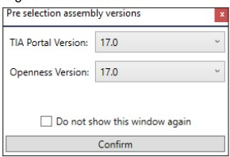{ #fig-6-10 }


## 6.4 预选模块

要使用 Sinamics Startdrive、STEP 7、WinCC Professional 或 WinCC Unified 的相关功能，必须安装相应的软件模块。随后，TIA Portal Openness Demo应用的模块扩展将从预设目录中加载（参见“设置”），并作为选项提供（参见图 6-11）。

如果您选择“SinamicsStartdriveModule”模块，根据项目大小不同，打开项目可能需要稍长一些时间。这是因为“SinamicsStartdriveModule”会将驱动单元加载到项目树中。每个驱动单元可能包含大量参数。

!!! note
    如果您选择"SinamicsStartdriveModule"模块，根据项目大小不同，打开项目可能需要稍长一些时间。这是因为"SinamicsStartdriveModule"会将驱动单元加载到项目树中。每个驱动单元可能包含大量参数。

首次启动应用程序时，ApplicationSettings 会自动选中所有模块进行加载。请禁用无法加载的模块，以防止加载模块时可能出现的错误（更多信息请参见"设置"）。


!!! note
    请注意，API 调用并非在服务属性 TiaPortal 上执行，而是在 TiaPortal 中同名的 Siemens.Engineering 对象上执行。因此，.Attach() 方法返回的值是一个 TIA Portal 实例，该实例会被赋值给同名的服务属性 TiaPortal。


## 6.5 主窗口

应用程序的主视图分为多个窗格。这些窗格在侧边面板中以显示或可选地隐藏有关 TIA Portal 实例以及项目/全局库的信息。单击内容窗格会自动隐藏侧边面板。

图 6-11
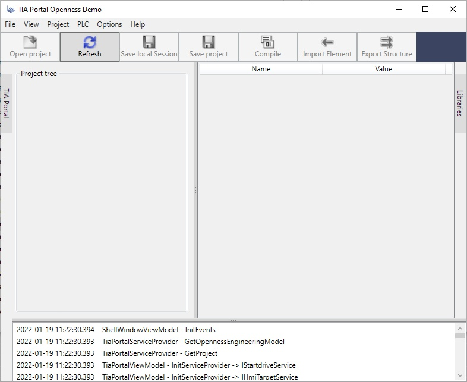{ #fig-6-11 }

表 6-6

| 编号 | 说明 |{ #table-6-6 }
|------|------|
| 1. | 按主题分组的应用程序菜单。 |
| 2. | 直接访问关键功能的工具栏。 |
| 3. | 此窗格显示项目树。逻辑视图和物理视图之间有所区别。您可以通过"视图"菜单定义要查看哪种视图。 |
| 4. | 此窗格以列表形式显示在项目树中高亮显示的条目的属性，包括名称和属性值。它使用所谓的 ContentBlackList 来定义不显示的属性。此 ContentBlackList 可以在项目 TiaPortalOpennessAdapter 的项目文件夹 Models.V17_0 中找到。 |
| 5. | 通过此按钮，您可以显示或隐藏 TIA Portal 侧边面板（参见"TIA Portal"侧边面板）。 |
| 6. | 通过此按钮，您可以显示或隐藏项目和全局库的侧边面板（参见"库"侧边面板）。 |
| 7. | 此窗格显示跟踪监视器的信息。所有活动都可以以应用程序日志的形式进行跟踪。这在重现某些行为时特别有用。跟踪监视器的信息也可以通过"关于"对话框复制到剪贴板（参见关于 TIA Portal Openness Demo），并从此处按用户 wished 进行处理。 |

## 6.6 "TIA Portal" 侧边面板

图 6-12
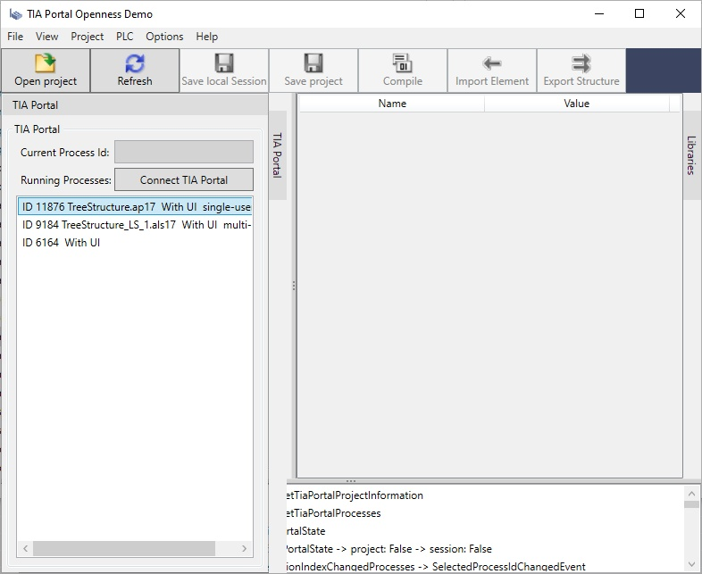{ #fig-6-12 }

表 6-7

| 编号 | 说明 |{ #table-6-7 }
|------|------|
| 1. | 应用程序连接到的 TIA Portal 实例的进程 ID。 |
| 2. | 可以通过此按钮与列表中高亮显示的实例建立连接（参见第 3 项）。 |
| 3. | 本地 PC 上运行的所有 TIA Portal 实例的列表。关于此实例的信息由进程 ID、项目名称、启动模式信息（带或不带 UI）以及实例类型（单用户或多用户实例）组成。 |

## 6.7 "库"侧边面板

### 6.7.1 项目库

图 6-14
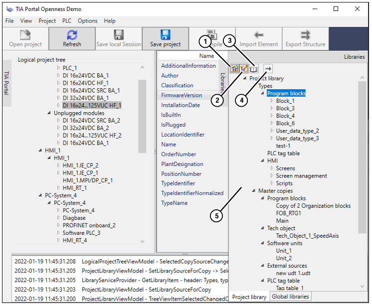{ #fig-6-14 }

表 6-8

| 编号 | 说明 |{ #table-6-8 }
|------|------|
| 1. | 为树中高亮显示的组创建新的子组（参见第 5 项）（参见创建或编辑组）。 |
| 2. | 编辑树中高亮显示的组的名称（参见第 5 项）（参见创建或编辑组）。 |
| 3. | 显示复制类型版本的对话框（参见将类型版本从项目库复制到项目）。 |
| 4. | 导出树中高亮显示的类型版本（参见第 5 项）（参见导出类型版本）。 |
| 5. | 项目库的内容，以树的形式显示。 |

#### 6.7.1.1 创建或编辑组

图 6-15
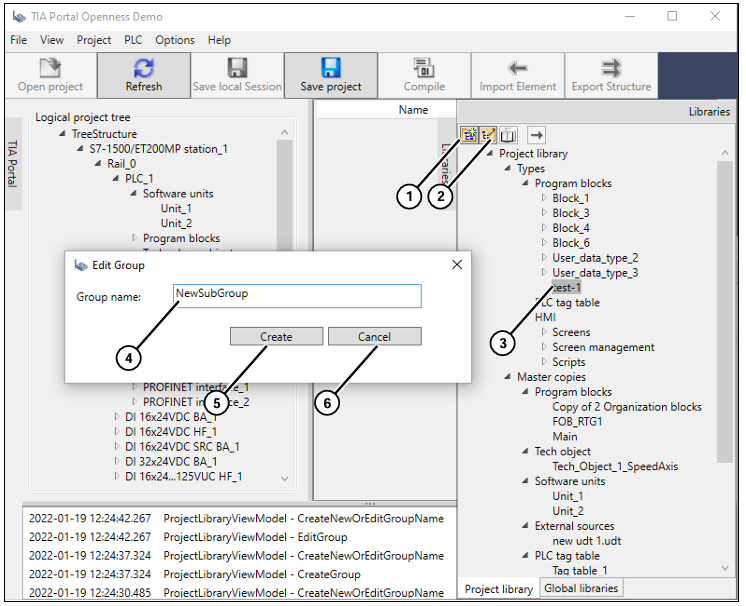{ #fig-6-15 }

表 6-9

| 编号 | 说明 |{ #table-6-9 }
|------|------|
| 1. | 为树中高亮显示的组创建新的子组。 |
| 2. | 编辑树中高亮显示的组的名称。 |
| 3. | 树中高亮显示的组。 |
| 4. | 编辑后的树中高亮显示的组的名称。 |
| 5. | 应用更改。 |
| 6. | 取消创建或编辑。 |

#### 6.7.1.2 将类型版本从项目库复制到项目

图 6-16
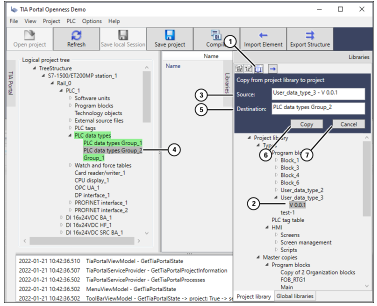{ #fig-6-16 }

表 6-10

| 编号 | 说明 |{ #table-6-10 }
|------|------|
| 1. | 显示复制类型版本的对话框。 |
| 2. | 树中高亮显示的、要复制的类型版本。可能的复制目标在 project tree 中自动标记为绿色。 |
| 3. | 树中高亮显示的、作为复制操作源的类型版本。 |
| 4. | 复制操作的目标，在项目树中高亮显示。 |
| 5. | 项目树中作为复制操作目标的元素高亮显示。 |
| 6. | 启动复制操作。 |
| 7. | 取消复制操作。 |

#### 6.7.1.3 导出类型版本

图 6-17
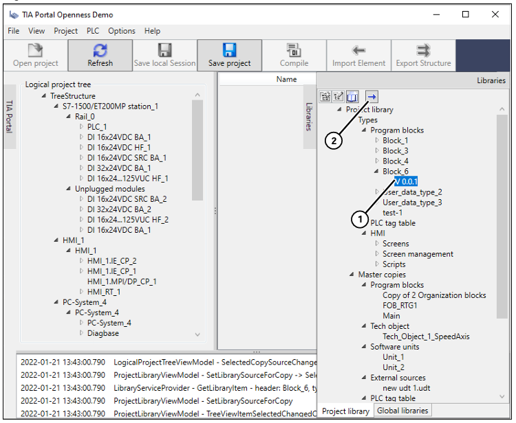{ #fig-6-17 }

表 6-11

| 编号 | 说明 |{ #table-6-11 }
|------|------|
| 1. | 树中高亮显示的、要导出的类型版本。 |
| 2. | 启动复制操作，并在设置中设置为"导出路径"的目录中生成以类型版本名称命名的导出文件（参见设置）。 |

### 6.7.2 全局库

图 6-18
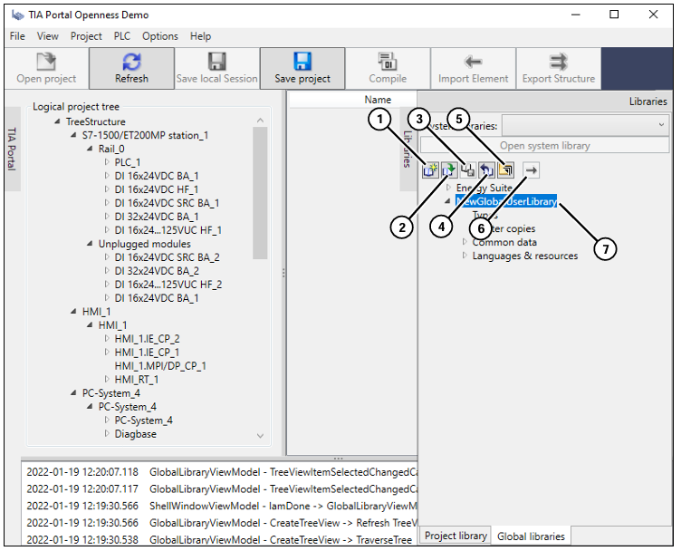{ #fig-6-18 }

表 6-12

| 编号 | 说明 |{ #table-6-12 }
|------|------|
| 1. | 创建新的全局用户定义库。 |
| 2. | 打开全局用户定义库。 |
| 3. | 保存对全局用户定义库的更改。 |
| 4. | 关闭选定的全局用户定义库。 |
| 5. | 用全局用户定义库的内容更新项目库。 |
| 6. | 导出类型版本。 |
| 7. | 打开的全局库列表。 |


图 6-19
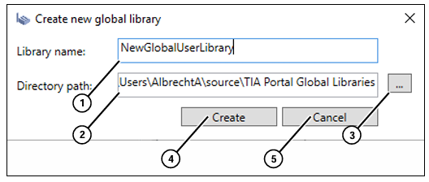{ #fig-6-19 }

表 6-13

| 编号 | 说明 |{ #table-6-13 }
|------|------|
| 1. | 要创建的新全局用户定义库的名称。 |
| 2. | 保存新库的路径（参见设置）。 |
| 3. | 打开文件夹选择对话框以更改路径（如需要）。 |
| 4. | 创建新库。 |
| 5. | 取消操作。 |


## 6.8 "文件"菜单

您可以在"文件"菜单中使用"打开 TIA Portal"来打开新的 TIA Portal 实例。

图 6-20
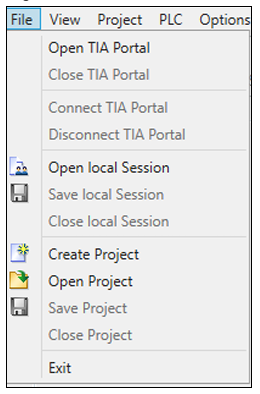{ #fig-6-20 }


### 6.8.1 打开 TIA Portal


根据序列图（参见图 6-7），通过 ModuleProvider 在类 TiaPortalViewModel 的方法 InitServiceProvider 中加载服务实例：

```csharp
_tiaPortalServiceProvider =
_moduleProvider.GetService(typeof(ITiaPortalServiceProvider)) as
ITiaPortalServiceProvider;
```

通过该实例，调用方法 OpenTiaPortalAsync；它创建一个新的 TIA Portal 实例，并将服务属性 TiaPortal 作为值赋值。

### 6.8.2 关闭 TIA Portal

在"文件"菜单中按"关闭 TIA Portal"以关闭打开的 TIA Portal 实例，该实例作为值分配给服务属性 TiaPortal（参见打开 TIA Portal）。任何打开的项目在此过程中将自动关闭。

服务实例（参见打开 TIA Portal）调用方法 CloseTiaPortal，该方法通过服务属性 TiaPortal（TIA Portal 实例）执行 API 调用 TiaPortal.GetCurrentProcess().Dispose();。

### 6.8.3 连接 TIA Portal

图 6-21
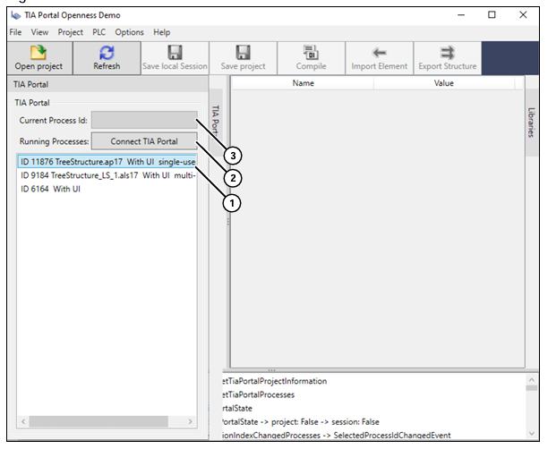{ #fig-6-21 }

图 6-22
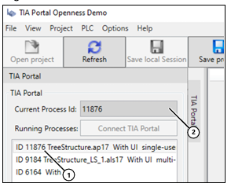{ #fig-6-22 }

"文件"菜单中的"连接 TIA Portal"或"连接 TIA Portal"按钮（参见图 6-21，第 2 项）可以与现有的 TIA Portal 实例建立连接。此实例中打开的项目将自动加载并打开用于编辑。为此，从所有运行进程的列表中选择实例（参见图 6-21，第 1 项），然后单击"连接 TIA Portal"按钮（参见图 6-21，第 2 项）。与 TIA Portal Openness Demo 应用程序连接的实例的进程 ID（参见图 6-22，第 1 项）将显示在"当前进程 ID:"字段中（参见图 6-22，第 2 项）。

通过服务实例（参见打开 TIA Portal），调用方法 ConnectTiaPortal(int processId)，该方法使用 API 调用 TiaPortal.GetProcess(processId, 5000).Attach(); 与相应 processId 的 TIA Portal 实例建立连接。

!!! note
    请注意，API 调用并非在服务属性 TiaPortal 上执行，而是在 TiaPortal 中同名的 Siemens.Engineering 对象上执行。因此，.Attach() 方法返回的值是一个 TIA Portal 实例，该实例会被赋值给同名的服务属性 TiaPortal。


### 6.8.4 断开 TIA Portal 连接

在“文件”菜单中单击“断开与 TIA Portal 的连接”，即可将演示应用程序从正在运行的 TIA Portal 实例中断开连接，而无需关闭该 TIA Portal 实例。

通过服务实例调用 DisconnectTiaPortal 方法（参见“打开 TIA Portal”）。该方法使用 API 调用 TiaPortal?.Dispose(); 来终止与 TIA Portal 实例的连接。

!!! note
    请注意，此 API 调用 .Dispose() 是在 TIA Portal 实例上执行的，即服务属性 TiaPortal。


### 6.8.5 打开本地会话

您可以使用“文件”菜单中的“打开本地会话”来打开一个本地会话实例。

根据序列图（参见图 6-7），通过 ModuleProvider 在类

BaseMultiuserProjectViewModel: MultiuserServiceProvider = \_moduleProvider.GetService(typeof(IMultiuserServiceProvider)) as IMultiuserServiceProvider;

通过该实例，会调用 OpenLocalSessionAsync 方法，该方法会在 TiaPortal 实例的 LocalSessionComposition 上，使用本地会话的项目文件调用 Open 方法。var localSession = tiaPortal.LocalSessions.Open(new FileInfo(projectPath));

单用户项目文件的文件扩展名为 \*.ap17，其中 17 代表创建该项目时所使用的版本号。

本地会话的项目文件扩展名为 \*.amc&lt;Version&gt;。相比之下，本地会话文件的扩展名为 \*.als&lt;Version&gt;。

这就是为什么 \*.ap 和 \*.als 会出现在 TIA Portal Openness Demo应用程序中（参见”TIA Portal”幻灯片面板）。

!!! note
    单用户项目文件的文件扩展名为 *.ap&lt;Version&gt;，其中 &lt;Version&gt; 代表创建该项目时所使用的版本号。本地会话的项目文件扩展名为 *.amc&lt;Version&gt;。相比之下，本地会话文件的扩展名为 *.als&lt;Version&gt;。


### 6.8.6 保存本地会话

在“文件”菜单中单击“保存本地会话”，将所有更改保存到本地会话中。在同

通过服务实例调用 SaveLocalSessionAsync 方法（参见“打开本地会话”）。该方法使用 API 调用 CurrentSession.Save();，其中 CurrentSession 是本地会话的实例。

### 6.8.7 关闭本地会话

在“文件”菜单中单击“关闭本地会话”，即可关闭已打开的本地会话。

通过服务实例调用 CloseLocalSessionAsync 方法（参见“打开本地会话”）；该 API 调用

var localSession = TiaPortal.LocalSessions.FirstOrDefault(); localSession?.Close(); 关闭本地会话。

### 6.8.8 创建项目

在”文件”菜单中单击”创建项目”以创建一个新项目。为此，您必须输入项目名称以及项目将被创建和保存的目标文件夹（参见图 6-23）。

图6-23
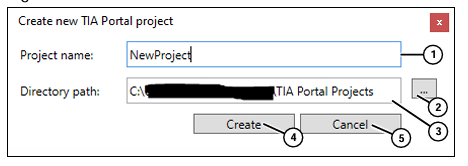{ #fig-6-23 }


表 6-14

<table><tr><td>编号</td><td>说明</td></tr><tr><td>1.</td><td>为新项目输入名称。 名称必须符合 Windows 的文件命名规则。</td></tr><tr><td>2.</td><td>打开”文件资源管理器”，选择将要创建新项目的目标目录。</td></tr><tr><td>3.</td><td>新项目将创建的路径是从设置中读取的（参见”设置”），并显示在文本框中。如果需要，可以对其进行编辑。</td></tr><tr><td>4.</td><td>点击”创建”按钮以创建新项目。 通过调用 ValidationProvider，系统将首先验证您的输入；若验证通过，对话框将关闭，并创建新项目。</td></tr><tr><td>5.</td><td>如需中止该过程，请点击”取消”按钮。</td></tr></table>


根据序列图（见图 6-7），通过 ModuleProvider 在类

BaseProjectViewModel: ProjectServiceProvider = \_moduleProvider.GetService(typeof(IProjectServiceProvider)) as IProjectServiceProvider;

通过该实例，调用了 CreateProjectAsync 方法，该方法通过 API 调用 var newProject = TiaPortal.Projects.Create(opennessDemoModel.ProjectModel.TargetDirectory, opennessDemoModel.ProjectModel.ProjectName); 来创建一个新项目。

### 6.8.9 打开项目

通过“文件”菜单中的“打开项目”打开一个项目。为此，请使用文件选择对话框选择所需的项目文件（参见图 6-24）。 文件过滤器设置为 \*.ap\*，以便显示所有项目版本。随后项目打开，项目数据（项目树）被加载到应用程序中（参见图 6-26 和图 6-27）。

通过服务实例（参见“创建项目”），调用 OpenProjectAsync(string projectPath) 方法。该方法使用 API 调用 Project newProject = tiaPortal.Projects.Open(new FileInfo(projectPath)); 来打开作为参数传递的所选项目。

图 6-24
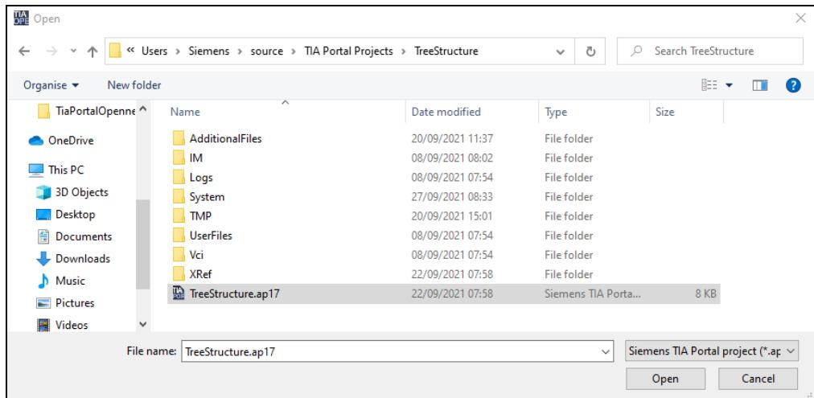{ #fig-6-24 }

### 6.8.10 保存项目

“文件”菜单中的“保存项目”可将项目中的所有更改保存下来。

通过服务实例（参见“创建项目”），调用 SaveProjectAsync 方法。该方法使用 API 调用 ((Project)CurrentProject).Save(); 来保存对项目所做的所有更改。

### 6.8.11 关闭项目

“文件”菜单中的“关闭项目”选项可关闭当前打开的项目。

通过服务实例（参见“创建项目”），调用 CloseProjectAsync 方法。该方法使用 API 调用 var project =

先调用 TiaPortal.Projects.FirstOrDefault(); 来确定当前打开的是哪个项目。然后通过 API 调用 project?.Close(); 关闭该项目。

<table><tr><td>查看</td><td>项目</td><td>PLC</td><td>光学</td></tr><tr><td></td><td colspan="3">刷新</td></tr><tr><td></td><td colspan="3">逻辑树</td></tr><tr><td></td><td colspan="3">物理树</td></tr></table>

## 6.9 “视图”菜单

图 6-25
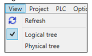{ #fig-6-25 }

通过“视图”菜单，您可以切换项目中的逻辑树结构和物理树结构。参见图 6-26 和图 6-27。

根据序列图（参见图 6-7），在“视图”菜单中单击“逻辑树”或“物理树”将调用 TiaPortalOpennessCore 项目中 MenuViewModel 类中的命令处理程序 SetNavigationPath(string navigationPath)。 系统将要显示或导航到的视图名称将作为参数传递。

```text
<MenuItem Header="_View">
    <MenuItem
    Command="{Binding TreeViewNavigationCommand}"
    CommandParameter="LogicalProjectTreeView"
    Header="Logical tree"
    IsChecked="{Binding ShowLogicalTree}" />
    <MenuItem
    Command="{Binding TreeViewNavigationCommand}"
    CommandParameter="PhysicalProjectTreeView"
    Header="Physical tree"
    IsChecked="{Binding ShowLogicalTree, Converter={StaticResource IbConverter}}" />
</MenuItem>
```

命令处理程序 SetNavigationPath(string navigationPath) 随后会调用 Navigate(string navigationPath) 方法，其中会执行 \_regionManager.RequestNavigate(RegionNames.ProjectTreeRegion, navigationPath); 这一操作。

这将显示菜单（CommandParameter）所选的视图。

视图的 ViewModel 会查找所需的数据，并将其准备好以供显示。

例如，要显示“逻辑树”，需要调用 \_regionManager.RequestNavigate(RegionNames.ProjectTreeRegion, navigationPath); 方法，从而触发 LogicalProjectTreeViewModel 类中的 OnNavigatedTo(NavigationContext navigationContext) 方法，该方法会调用基类 BaseProjectViewModel 中的 LoadTreeDataAsync(true); 方法。 然后，通过 ProjectService 调用 \_projectService.LoadTreeStructure(loadLogicalTree); 方法，该方法进而通过多次 API 调用获取项目树，并将其作为值赋给项目模型 \_projectModel.LogicalTree; 的属性。

### 6.9.1 逻辑视图


这里有一个例外，即“设备组”，因为它没有导轨或机架。因此，使用设备名称作为额外的分组依据。

逻辑树结构将所有设备按机架或机柜进行分类。所有未插电的设备均与机架或机柜位于同一层级（参见图 6-26中的红色方框）。
图6-26
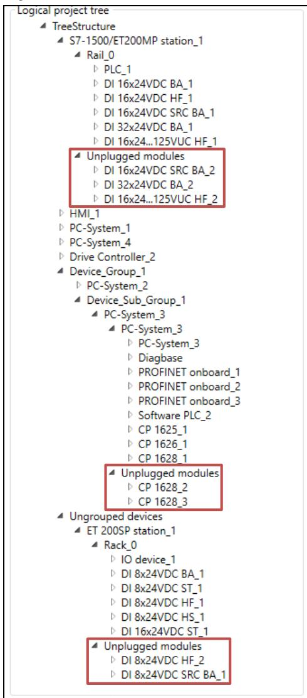{ #fig-6-26 }

### 6.9.2 物理视图

在物理树结构中，所有设备都位于一个站点的下方；在此，一条轨道及其上的所有设备（包括未连接的设备）位于同一层级。有关哪些设备已断开连接、哪些未断开连接的信息，请参阅属性视图（参见[图 6-28](#fig-6-28)）。

图6-27
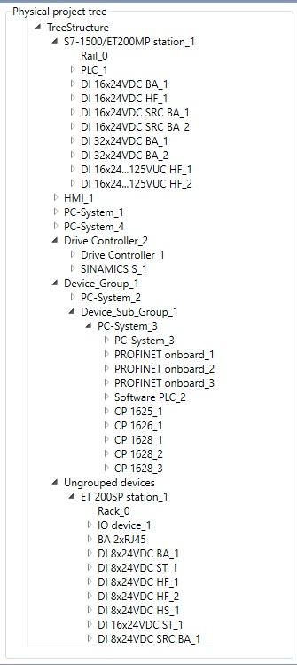{ #fig-6-27 }

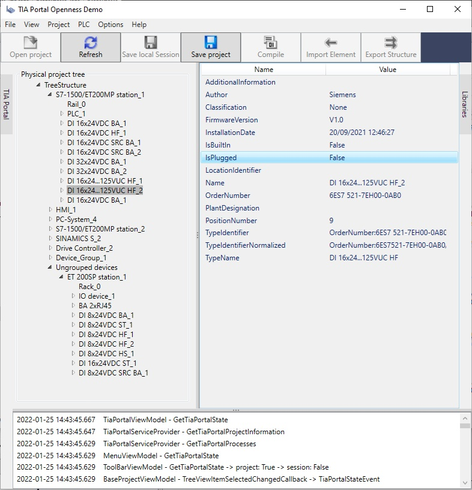{ #fig-6-28 }

物理项目树


## 6.10 "项目"菜单

在此菜单中，您可以找到可在项目级别或项目项上运行的功能。

图6-29
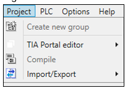{ #fig-6-29 }


### 6.10.1 创建新组

图6-30
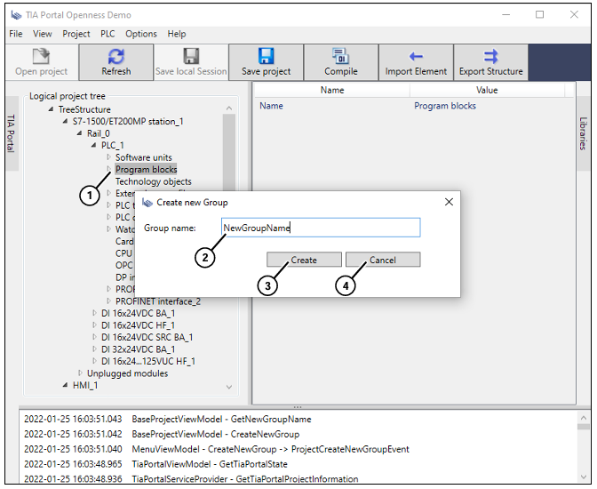{ #fig-6-30 }

表 6-15

| 编号 | 说明 |{ #table-6-15 }
|------|------|
| 1. | 在项目树中高亮显示、将为其创建新子组的元素。 |
| 2. | 新组的名称。 |
| 3. | 为高亮显示的元素创建新组（作为子组）并关闭对话框。 |
| 4. | 取消操作并关闭对话框。 |

根据序列图（参见图 6-7），通过 ModuleProvider 在类 BaseProjectViewModel 的方法 InitProjectServiceProvider 中加载服务实例：

```csharp
ProjectServiceProvider =
_moduleProvider.GetService(typeof(IProjectServiceProvider)) as
IProjectServiceProvider;
```

通过该实例，调用方法 ProjectServiceProvider.CreateNewGroup(newGroupName, (string)SelectedItem.Header, (Guid)SelectedItem.Tag, true);。这里，正在创建的组的名称、高亮显示的元素的名称（参见图 6-30，第 1 项）和高亮显示元素的 GUID 作为参数传递。调用中的第四个参数表示我们正在处理逻辑项目树，并且项目项应在其中找到。

使用这些信息找到项目项，并进行 var parentProjectItem = GetProjectItem(parentGroup, tag, logicalTree); 调用。

找到的项目项同时传递给 GroupEditorService（ProjectServiceProvider 的子服务）和 _plcSoftwareService 的实例。每个服务自行决定是否可以处理项目项。

```csharp
if (parentProjectItem != null)
{
  using (var groupService = new GroupEditorService(_traceLogService))
  {
    groupService.CreateGroup(parentProjectItem, groupName);
  }
  _plcSoftwareService?.CreateGroup(parentProjectItem.DeviceItem, groupName);
}
```

如果高亮显示的元素是 DeviceUserGroup，则通过 groupService 为该项目创建新组，API 调用为 typeGroup.Groups.Create(groupName); 并添加 DeviceUserGroupComposition。

如果高亮显示的元素是 PLC 类型，则使用 _plcSoftwareService 来确定它实际是什么类型的 PLC 类型；并通过其类型特定的 API 调用 -UserGroupComposition.Groups.Create(groupName); 创建并添加新组。

### 6.10.2 "TIA Portal 编辑器" 子菜单

通过此菜单，您可以控制 TIA Portal 中的视图，并在 TIA Portal 中显示高亮显示的项目项。实际上，这使其成为某种遥控器。


图6-31
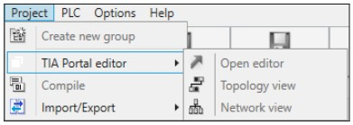{ #fig-6-31 }

#### 6.10.2.1 打开编辑器

"项目 -> TIA Portal 编辑器"菜单中的"打开编辑器"让您可以为项目树中高亮显示的元素在 TIA Portal 中打开相应的硬件编辑器，然后在此编辑项目项。

根据序列图（参见图 6-7），通过 ModuleProvider 在类 BaseProjectViewModel 的方法 InitProjectServiceProvider 中加载服务实例：

```csharp
ProjectServiceProvider =
_moduleProvider.GetService(typeof(IProjectServiceProvider)) as
IProjectServiceProvider;
```

根据所选的视图，在 LogicalProjectTreeViewModel 或 PhysicalProjectTreeViewModel 类中调用方法 OpenEditor。在该方法中，在服务实例上调用同名的 OpenEditor 方法。

基于名称（header）和 GUID，服务确定关联的项目项并执行实际的 API 调用。如果项目项不是 Device 类型，则通过反射尝试查找"ShowInEditor"方法。如果项目提供此类方法，则运行它。否则，项目项无法在任何硬件编辑器中显示。

```csharp
var projectItem = GetProjectItem(header, tag, logical);
if (projectItem != null)
{
  if (projectItem.DeviceItem is Device projectItemDevice)
  {
    projectItemDevice.ShowInEditor(View.Device);
  }
  else
  {
    var type = projectItem.DeviceItem.GetType();
    var methodInfo = type.GetMethod("ShowInEditor");
    if (methodInfo == null && type.BaseType != null)
    {
      methodInfo = type.BaseType.GetMethod("ShowInEditor");
    }
    if (methodInfo != null)
    {
      methodInfo.Invoke(projectItem.DeviceItem, null);
    }
  }
}
```

#### 6.10.2.2 拓扑视图

"项目 -> TIA Portal 编辑器"菜单中的"拓扑视图"让您可以打开 TIA Portal 中项目的拓扑视图（参见[图 6-32](#fig-6-32)）。

根据序列图（参见图 6-7），通过 ModuleProvider 在类 BaseProjectViewModel 的方法 InitProjectServiceProvider 中加载服务实例：

```csharp
ProjectServiceProvider =
_moduleProvider.GetService(typeof(IProjectServiceProvider)) as
IProjectServiceProvider;
```

在 BaseProjectViewModel 类中，调用方法 OpenTopologyEditor，其中在服务实例上运行调用 ProjectServiceProvider.ShowEditor("Topology");。

服务首先使用名为"Topology"的视图来确定相应的 View Type，然后执行 API 调用。

```csharp
var viewType = EnumService.GetEnumValue<View>(viewName);
CurrentProject.ShowHwEditor(viewType);
```


图6-32
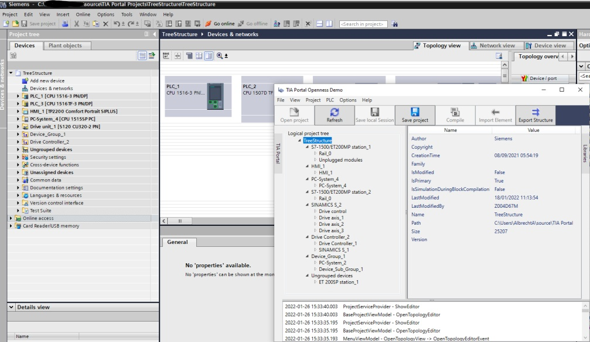{ #fig-6-32 }

#### 6.10.2.3 网络视图

"项目 -> TIA Portal 编辑器"菜单中的"网络视图"让您可以打开 TIA Portal 中项目的网络视图（参见[图 6-33](#fig-6-33)）。

根据序列图（参见图 6-7），通过 ModuleProvider 在类 BaseProjectViewModel 的方法 InitProjectServiceProvider 中加载服务实例：

```csharp
ProjectServiceProvider =
_moduleProvider.GetService(typeof(IProjectServiceProvider)) as
IProjectServiceProvider;
```

在 BaseProjectViewModel 类中，调用方法 OpenNetworkEditor，其中在服务实例上执行调用 ProjectServiceProvider.ShowEditor("Network");。

服务首先使用名为"Network"的视图来确定相应的 View Type，然后执行 API 调用。

```csharp
var viewType = EnumService.GetEnumValue<View>(viewName);
CurrentProject.ShowHwEditor(viewType);
```

图6-33
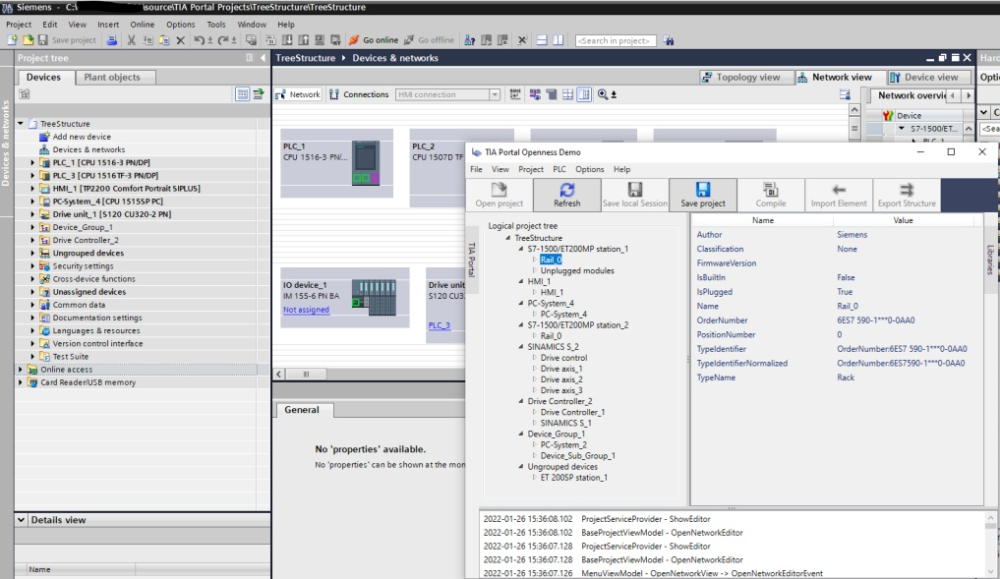{ #fig-6-33 }

### 6.10.3 编译

图6-34
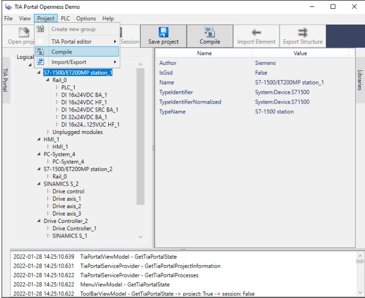{ #fig-6-34 }

编译项目树中高亮显示的元素，只要该对象实现了接口 ICompilable（参见[图 6-34](#fig-6-34)）。

根据序列图（参见图 6-7），通过 ModuleProvider 在类 BaseProjectViewModel 的方法 InitProjectServiceProvider 中加载服务实例：

```csharp
ProjectServiceProvider =
_moduleProvider.GetService(typeof(IProjectServiceProvider)) as
IProjectServiceProvider;
```

根据所选的视图，在 LogicalProjectTreeViewModel 或 PhysicalProjectTreeViewModel 类中调用方法 DoCompile。在该方法中，在服务实例上调用同名方法。

```csharp
ProjectServiceProvider.DoCompile((string)SelectedItem.Header,
(Guid)SelectedItem.Tag, navigationContext.ShowLogicalTree);
```

确定实际 API 调用的项目项和编译器。这里，编译器被给予要编译的项目项。_compilerResult 被评估并写入 Trace 输出。

```csharp
var projectItem = GetProjectItem(header, tag, logical);
if (projectItem != null)
{
  var methodInfo = GetGenericMethodInfo(projectItem, typeof(ICompilable));
  if (methodInfo != null)
  {
    var compiler = GetCompiler(methodInfo, projectItem);
    if (compiler != null)
    {
      _compilerResult = compiler.Compile();
      var compilerMessage = "Compiling " + projectItem.Header;
      WriteTraceLogProxy(processInfo.ProcessMessage + " - " + compilerMessage);
      if (_compilerResult.Messages.Count > 0)
      {
        if (_compilerResult.Messages != null && _compilerResult.Messages.Count > 0)
        {
          GetCompilerMessages(string.Empty, string.Empty, _compilerResult.Messages);
        }
      }
    }
  }
}
```

### 6.10.4 "导入/导出" 子菜单

图6-35
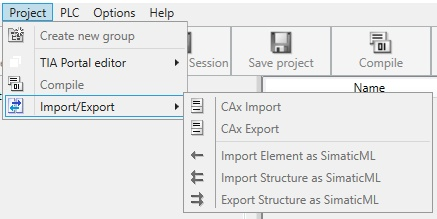{ #fig-6-35 }

#### 6.10.4.1 CAx 导入

CAx 导入用于以 AML 格式导入设备数据。支持以下导入选项。


图6-36
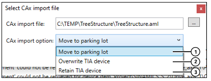{ #fig-6-36 }


表 6-16

| 编号 | 说明 |{ #table-6-16 }
|------|------|
| 1. | 如果在导入 CAx 数据时发生名称冲突，则名称冲突的设备 CAx 数据将被放置在占位符文件夹中。 |
| 2. | 如果在导入 CAx 数据时发生名称冲突，则名称冲突设备的 CAx 数据将在 TIA Portal 项目中被导入的 CAx 数据覆盖。 |
| 3. | 如果在导入 CAx 数据时发生名称冲突，则具有名称冲突的 CAx 数据将被忽略，不会被导入。 |

```csharp
if (CurrentProject != null)
{
  using (var importService = new ImportService(_traceLogService))
  {
    importService.CaxImport((Project)CurrentProject, importFileInfo, importOption);
  }
  return true;
}
```

对于实际的 API 调用，首先找到导入提供程序 var importProvider = project.GetService&lt;CaxProvider&gt;();，然后在上面进行 API 调用 importProvider.Import(caxImportFileInfo, logFileInfo, caxImportOption);。

#### 6.10.4.2 CAx 导出


图6-37
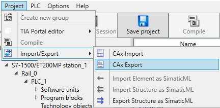{ #fig-6-37 }

CAx 导出以 AML 格式导出设备数据。CAx 导出在项目级别或设备级别都是可能的。

```csharp
if (CurrentProject != null)
{
  using (var exportService = new ExportService(_traceLogService, _settingsService))
  {
    exportService.CaxExport((Project)CurrentProject);
  }
  return true;
}
```

对于实际的 API 调用，首先找到导入提供程序 var exportProvider = project.GetService&lt;CaxProvider&gt;();，然后在上面进行 API 调用 exportProvider.Export(project, caxExportFileInfo, logFileInfo);。

#### 6.10.4.3 将元素导入为 Simatic ML


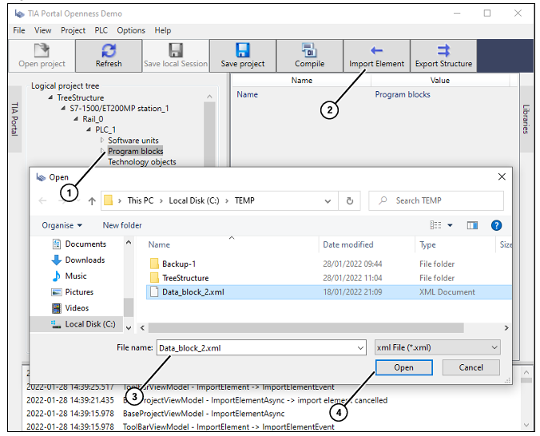

表 6-17

| 编号 | 说明 |{ #table-6-17 }
|------|------|
| 1. | 将导入元素的区域高亮显示。 |
| 2. | 通过工具栏或菜单"项目 > 导入/导出 > 将元素导入为 SimaticML"运行"导入元素"功能（参见[图 6-39](#fig-6-39)）。 |
| 3. | 选择要导入的 XML 数据。 |
| 4. | 确认导入数据并调用函数。 |


图6-38
图6-39
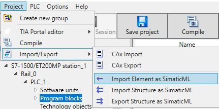{ #fig-6-39 }

根据序列图（参见图 6-7），通过 ModuleProvider 在类 BaseProjectViewModel 的方法 InitProjectServiceProvider 中加载服务实例：

```csharp
ProjectServiceProvider =
_moduleProvider.GetService(typeof(IProjectServiceProvider)) as
IProjectServiceProvider;
```

根据所选的视图，在 LogicalProjectTreeViewModel 或 PhysicalProjectTreeViewModel 类中调用方法 ImportElementAsync。在该方法中，在服务实例上调用同名方法。

```csharp
ProjectServiceProvider.ImportElementAsync(fileInfos, true,
(string)SelectedItem.Header, (Guid)SelectedItem.Tag,
LogicalTreeView);
```

#### 6.10.4.4 将结构导入为 Simatic ML


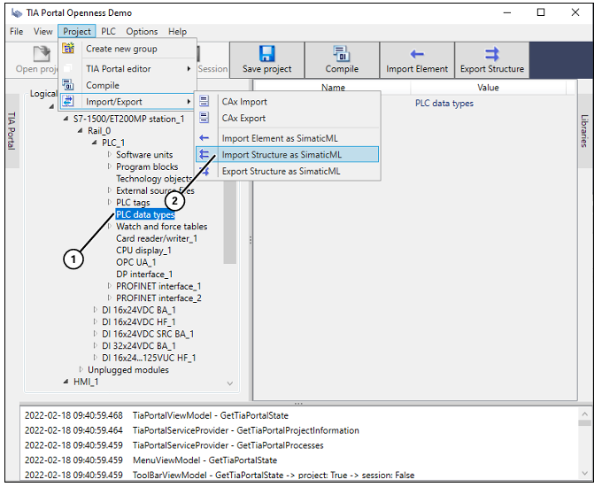

表 6-18

| 编号 | 说明 |{ #table-6-18 }
|------|------|
| 1. | 将导入下级结构的区域高亮显示。 |
| 2. | 启动"将结构导入为 SimaticML"功能首先打开选择对话框，您可以在其中选择要作为下级结构导入的文件夹（参见[图 6-41](#fig-6-41)）。所有子文件夹及其中的类型将一起导入。 |

!!! note
    请注意，选定的导入目录本身（参见[图 6-41](#fig-6-41)）作为根目录不会被导入。仅导入选定目录中的所有子文件夹。


图6-40
图6-41
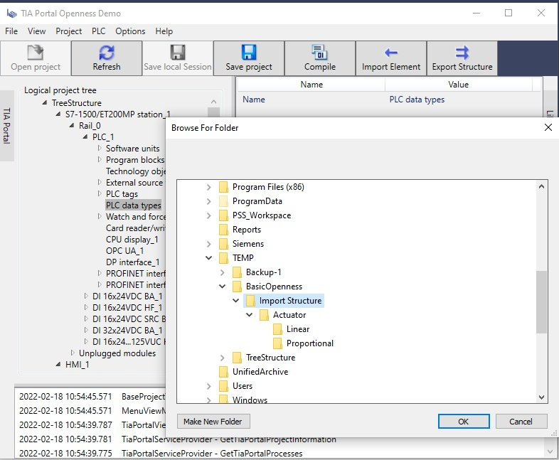{ #fig-6-41 }

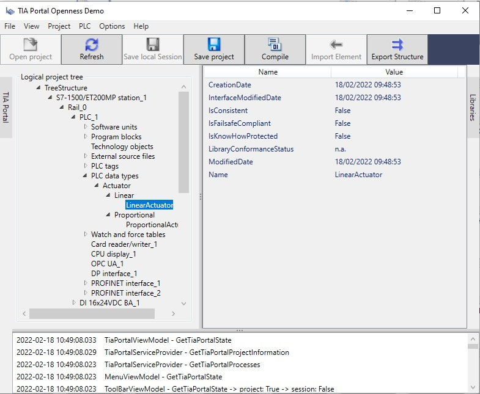

根据序列图（参见图 6-7），通过 ModuleProvider 在类 BaseProjectViewModel 的方法 InitProjectServiceProvider 中加载服务实例：

```csharp
ProjectServiceProvider =
_moduleProvider.GetService(typeof(IProjectServiceProvider)) as
IProjectServiceProvider;
```

根据所选的视图，通过 LogicalProjectTreeViewModel 或 PhysicalProjectTreeViewModel 类在基类 BaseProjectViewModel 中调用方法 ImportStructureAsync。在该方法中，在服务实例上调用同名方法。

```csharp
ProjectServiceProvider.ImportElementAsync(folderBrowser.SelectedPath,
(string)SelectedItem.Header, (Guid)SelectedItem.Tag,
LogicalTreeView);
```

运行导入结构的 API 函数需要 ExclusiveAccess。运行检查将导入哪种类型的结构——CheckIsPlcStructureDestination 或 CheckIsHmiTargetStructureDestination——并为该类型运行相应的导入服务（_plcSoftwareService?.ImportStructure 或 _hmiTargetService?.ImportStructure），只要在应用程序启动时加载了所需的模块。

```csharp
using (var exclusiveAccess = tiaPortal?.ExclusiveAccess("Import element"))
{
  if (exclusiveAccess != null)
  {
    if (CheckIsPlcStructureDestination(projectItem.DeviceItem))
    {
      using (var transaction = exclusiveAccess.Transaction(CurrentProject, "Import structure"))
      {
        bool? result = _plcSoftwareService?.ImportStructure(projectItem.DeviceItem, importFolderPath, ImportOptions.Override);
        transaction.CommitOnDispose();
        if (result != null && result == true)
        {
          WriteTraceLogProxy(processInfo.ProcessMessage + " - " + nameof(_plcSoftwareService) + " - Import structure finished succeed");
        }
      }
    }
    if (CheckIsHmiTargetStructureDestination(projectItem.DeviceItem))
    {
      using (var transaction = exclusiveAccess.Transaction(CurrentProject, "Import structure"))
      {
        bool? result = _hmiTargetService?.ImportStructure(projectItem.DeviceItem, importFolderPath, ImportOptions.Override);
        transaction.CommitOnDispose();
        if (result != null && result == true)
        {
          WriteTraceLogProxy(processInfo.ProcessMessage + " - " + nameof(_hmiTargetService) + " - Import structure finished succeed");
        }
      }
    }
  }
}
```

#### 6.10.4.5 将结构导出为 Simatic ML


图6-43
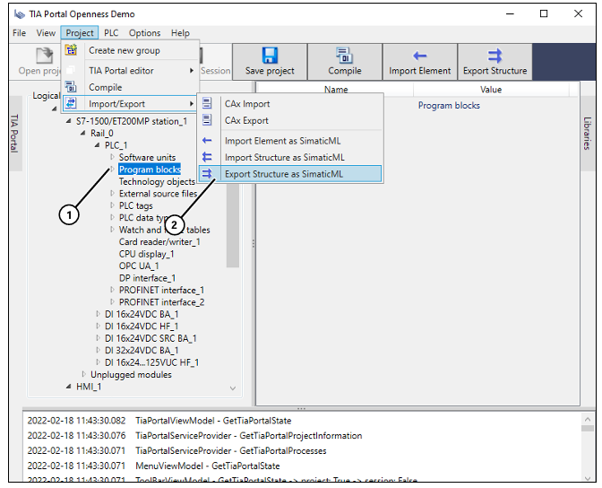{ #fig-6-43 }

表 6-19

| 编号 | 说明 |{ #table-6-19 }
|------|------|
| 1. | 将作为结构导出的区域高亮显示。 |
| 2. | 通过菜单"项目 > 导入/导出 > 将结构导出为 SimaticML"或工具栏启动导出。 |

根据序列图（参见图 6-7），通过 ModuleProvider 在类 BaseProjectViewModel 的方法 InitProjectServiceProvider 中加载服务实例：

```csharp
ProjectServiceProvider =
_moduleProvider.GetService(typeof(IProjectServiceProvider)) as
IProjectServiceProvider;
```

根据所选的视图，在 LogicalProjectTreeViewModel 或 PhysicalProjectTreeViewModel 类中调用方法 ExportStructureAsync。在该方法中，在服务实例上调用同名方法。

```csharp
ProjectServiceProvider.ExportStructureAsync((string)SelectedItem.Header, (Guid)SelectedItem.Tag, LogicalTreeView);
```

## 6.11 "PLC" 菜单

### 6.11.1 添加外部源

如果项目树中高亮显示"外部源文件"，您可以通过菜单"PLC -> 源文件 -> 添加外部源"添加文件。将首先打开文件选择对话框，您可以在其中选择类型为 *.awl、*.scl、*.db 或 *.udt 的文件。打开选定的文件后，它将作为新文件添加。


图6-44
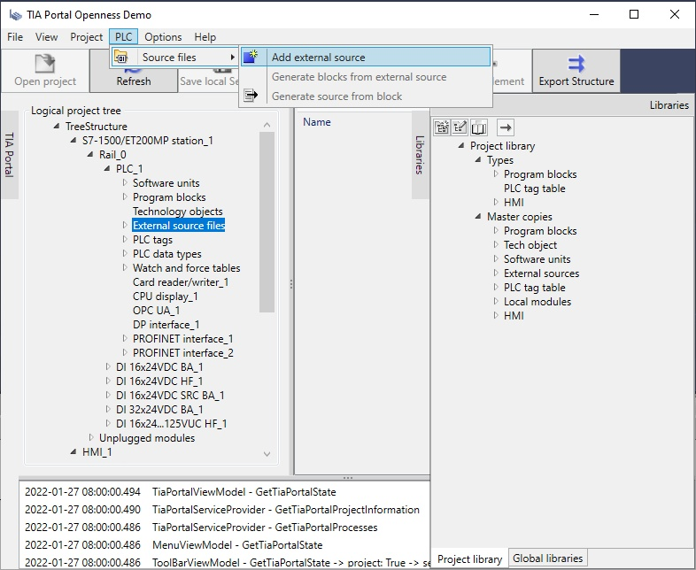{ #fig-6-44 }

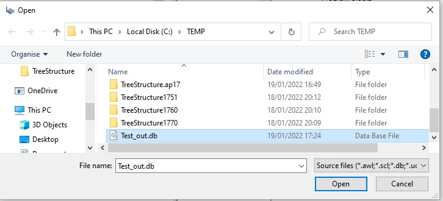

根据序列图（参见图 6-7），通过 ModuleProvider 在类 BaseProjectViewModel 的方法 InitProjectServiceProvider 中加载服务实例：

```csharp
ProjectServiceProvider =
_moduleProvider.GetService(typeof(IProjectServiceProvider)) as
IProjectServiceProvider;
```

在 BaseProjectViewModel 类中，调用方法 AddExternalSource，其中在服务实例上执行调用 ProjectServiceProvider.AddExternalSourceAsync(fileInfos, (string)SelectedItem.Header, (Guid)SelectedItem.Tag, LogicalTreeView);。所选文件的 FileInfo、高亮显示的元素的名称（参见[图 6-44](#fig-6-44)）和选定元素的 GUID 作为参数传递。调用中的第四个参数表示我们正在处理逻辑项目树，并且项目项应在其中找到。

GetProjectItem(header, tag, logical) 从相应的树视图（逻辑或物理视图）加载项目项。对于 TiaPortal 实例，请求独占访问操作 tiaPortal?.ExclusiveAccess("Import element")。

```csharp
var projectItem = GetProjectItem(header, tag, logical);
if (projectItem != null)
{
  var destinationItem = projectItem.DeviceItem;
  if (destinationItem != null)
  {
    var tiaPortal = _tiaPortalServiceProvider.GetTiaPortal() as TiaPortal;
    using (var plcService = new PlcService(_traceLogService))
    {
      foreach (var fileInfo in sourceFileInfos)
      {
        using (var exclusiveAccess = tiaPortal?.ExclusiveAccess("Import element"))
        {
          using (var transaction = exclusiveAccess?.Transaction(CurrentProject, "Import element"))
          {
            plcService.AddExternalSource(destinationItem as PlcExternalSourceGroup, fileInfo);
            transaction?.CommitOnDispose();
            result = true;
          }
        }
      }
    }
  }
}
```

方法 AddExternalSource 在 PlcService 的实例上运行 (var plcService = new PlcService(_traceLogService))。该方法检查项目是否已分配具有此名称的外部源文件，如果是，则将其删除。然后，将选定的文件生成作为新的外部源并添加。

```csharp
var temp = plcExternalSourceGroup.ExternalSources.Find(Path.GetFileName(externalSourceFileInfo.FullName));
temp?.Delete();
plcExternalSourceGroup.ExternalSources.CreateFromFile(Path.GetFileName(externalSourceFileInfo.FullName), externalSourceFileInfo.FullName);
```

### 6.11.2 从外部源生成块

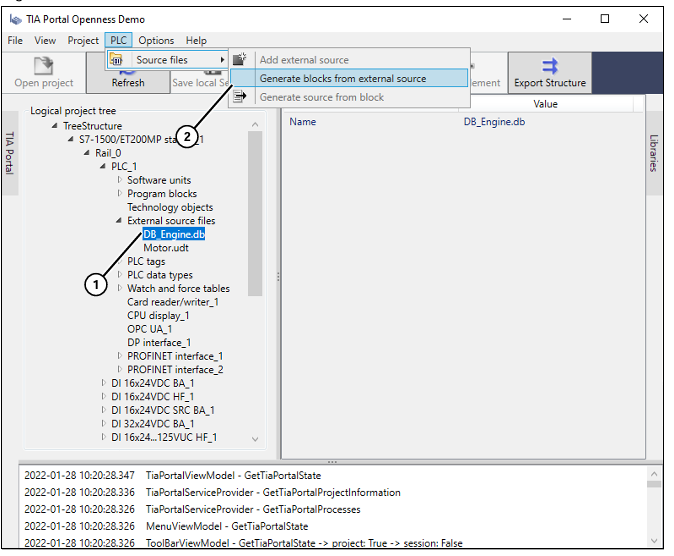

根据序列图（参见图 6-7），通过 ModuleProvider 在类 BaseProjectViewModel 的方法 InitProjectServiceProvider 中加载服务实例：

```csharp
ProjectServiceProvider =
_moduleProvider.GetService(typeof(IProjectServiceProvider)) as
IProjectServiceProvider;
```

在 BaseProjectViewModel 类中，调用方法 GenerateBlockFromSource，其中在服务实例上执行调用 ProjectServiceProvider.GenerateBlockFromSourceAsync((string)SelectedItem.Header, (Guid)SelectedItem.Tag, LogicalTreeView);。

项目树中高亮显示的元素的名称和 GUID（参见图 6-46，第 1 项），以及有关使用逻辑还是物理项目树的信息，用于搜索项目项。

```csharp
var projectItem = GetProjectItem(header, tag, logical);
if (projectItem != null)
{
  var destinationItem = projectItem.DeviceItem;
  if (destinationItem != null)
  {
    using (var plcService = new PlcService(_traceLogService))
    {
      plcService.GenerateBlockFromSource(destinationItem as PlcExternalSource);
      result = true;
    }
  }
}
```

表 6-20

| 编号 | 说明 |
|------|------|
| 1. | 类型为"外部源文件"的高亮显示项目项，将从中生成块。例如，外部源 DB_Engine 包含一个类型和一个数据块。 |

{ #table-6-20 }

```text
TYPE "Motor"
VERSION : 0.1
STRUCT
  Start : Bool;
  Stop : Bool;
  Temperature : Real;
  RPM : Real;
  State : Bool;
END_STRUCT;
END_TYPE
DATA_BLOCK "DB_Engine"
{ DB_Accessible_From_OPC_UA := 'FALSE' ;
  DB_Accessible_From_Webserver := 'FALSE' ;
  S7_Optimized_Access := 'TRUE' }
VERSION : 0.1
NON_RETAIN
VAR
  Motor_1 : "Motor";
  Motor_2 : "Motor";
  Motor_3 : "Motor";
  Motor_4 : "Motor";
END_VAR
BEGIN
END_DATA_BLOCK
```
| 2. | 从源文件生成目标块。 |

图6-46
图6-47
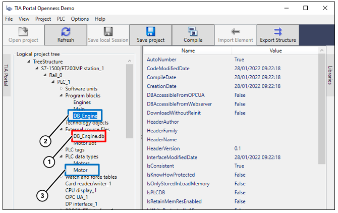{ #fig-6-47 }

目标块是从源文件生成的（另参见图 6-47，第 1 项）。外部源中的类型（参见表 6-20，第 1 项）被分配给相应的区域（参见图 6-47，第 2 和第 3 项）。

### 6.11.3 从块生成源

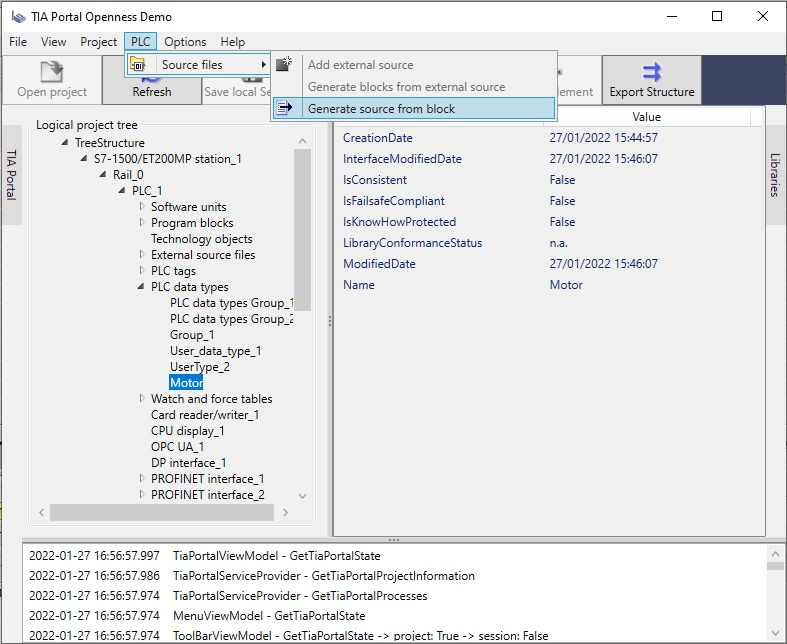{ #fig-6-48 }

例如，如果您在项目树中高亮显示了 PLC 数据类型，则可以使用菜单"PLC -> 源文件 -> 从块生成源"（参见[图 6-48](#fig-6-48)）从此数据类型创建源文件。源文件可以在另一个项目中重用。

首先打开"保存文件"对话框（参见[图 6-49](#fig-6-49)）。这里，根据高亮显示的元素，您可以选择文件类型 *.awl、*.scl、*.db 或 *.udt 并输入文件名。

根据序列图（参见图 6-8），通过 ModuleProvider 在类 BaseProjectViewModel 的方法 InitProjectServiceProvider 中加载服务实例：

```csharp
ProjectServiceProvider =
_moduleProvider.GetService(typeof(IProjectServiceProvider)) as
IProjectServiceProvider;
```

在 BaseProjectViewModel 类中，调用方法 GenerateSourceFromBlock，其中在服务实例上执行调用 ProjectServiceProvider.GenerateSourceFromBlockAsync(destinationFileInfo, (string)SelectedItem.Header, (Guid)SelectedItem.Tag, LogicalTreeView);。用于搜索项目项的参数是目标文件的文件信息、高亮显示的元素的名称、其 GUID，以及有关使用逻辑还是物理项目树的信息。

```csharp
var projectItem = GetProjectItem(header, tag, logical);
if (projectItem != null)
{
  var blockItem = projectItem.DeviceItem as IEngineeringInstance;
  var blockAsSource = projectItem.DeviceItem as IEngineeringInstance;
  if (blockItem != null)
  {
    do
    {
      blockItem = blockItem.Parent;
    } while (!(blockItem is PlcSoftware));
    using (var plcService = new PlcService(_traceLogService))
    {
      plcService.GenerateSourceFromBlock(blockItem as PlcSoftware, blockAsSource, destinationFileInfo, true);
      result = true;
    }
  }
}
```

实际的 API 调用在服务方法 plcService.GenerateSourceFromBlock 中执行。

```csharp
if (blockAsSource is PlcBlock plcBlock)
{
  if (withDependencies)
  {
    plcSoftware.ExternalSourceGroup.GenerateSource(new[] { plcBlock }, destinationFileInfo, GenerateOptions.WithDependencies);
  }
  else
  {
    plcSoftware.ExternalSourceGroup.GenerateSource(new[] { plcBlock }, destinationFileInfo, GenerateOptions.None);
  }
}
if (blockAsSource is PlcType plcType)
{
  plcSoftware.ExternalSourceGroup.GenerateSource(new[] { plcType }, destinationFileInfo);
}
```
图6-48
图6-49
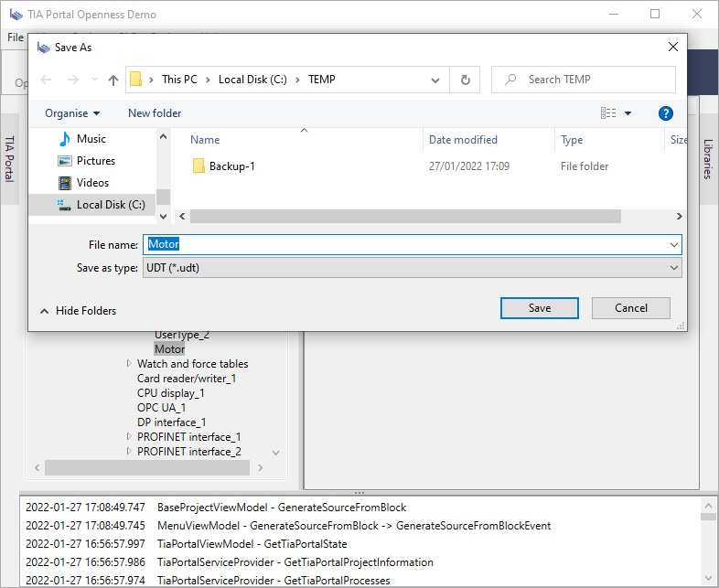{ #fig-6-49 }

## 6.12 "选项"菜单

图6-50
{ #fig-6-50 }


应用程序的设置让您能够定义许多参数的值，这些参数应用程序在运行相应功能时会自动加载和使用。设置可以随时更改。仅当您希望使用不同版本的 TIA Portal 和/或 Openness API 时，才需要在更改后重新启动应用程序。所有其他设置仅在使用时加载。

### 6.12.1 设置

图6-51
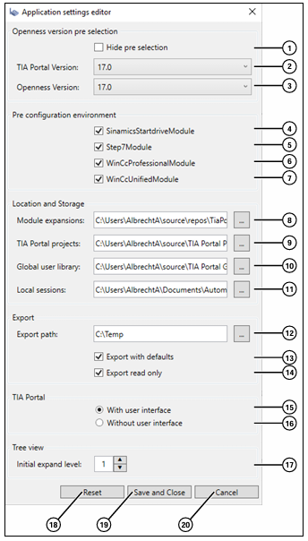{ #fig-6-51 }


表 6-21

| 编号 | 说明 |{ #table-6-21 }
|------|------|
| 1. | 此设置定义应用程序启动时是否显示选择 TIA Portal 和 Openness 版本的对话框（参见程序集解析）。 |
| 2. | 已安装的 TIA Portal 版本选择器。选定的版本将在应用程序启动时加载（参见程序集解析）。 |
| 3. | 已安装的 Openness API 版本选择器。选定的版本将在应用程序启动时加载（参见程序集解析）。 |
| 4. | 决定是否加载 SinamicsStartdriveModule。只有当您系统上安装了 Sinamics Startdrive 软件时，才应启用此模块的加载。 |
| 5. | 决定是否加载 Step7Module。只有当您系统上安装了 STEP 7 软件时，才应启用此模块的加载。 |
| 6. | 决定是否加载 WinCcProfessionalModule。只有当您系统上安装了 WinCC Professional 软件时，才应启用此模块的加载。 |
| 7. | 决定是否加载 WinCcUnifiedModule。只有当您系统上安装了 WinCC Unified 软件时，才应启用此模块的加载。 |
| 8. | 此路径指定应从哪个目录加载模块扩展。 |
| 9. | 设置默认项目目录。新项目将保存在此目录中。打开项目时，此路径用于文件选择对话框。 |
| 10. | 设置全局用户定义库的默认目录。新的全局用户定义库将保存在此目录中。打开全局用户定义库时，此路径用于文件选择对话框。 |
| 11. | 设置本地会话的默认目录。打开本地会话时，此路径将用于文件选择对话框。 |
| 12. | 设置默认导出目录。 |
| 13. | 导出时包含默认值。 |
| 14. | 导出时包含写保护的值。 |
| 15. | 使新的 TIA Portal 实例以用户界面启动。 |
| 16. | 使新的 TIA Portal 实例以无用户界面启动。 |
| 17. | 此值定义项目和库树将展开多少层级。 |
| 18. | 撤销所有更改并显示对话框打开时填充的值。 |
| 19. | 保存所有更改并关闭对话框。 |
| 20. | 不保存关闭对话框。 |

## 6.13 "帮助"菜单

图6-52
{ #fig-6-52 }


### 6.13.1 关于 TIA Portal Openness Demo

图6-53
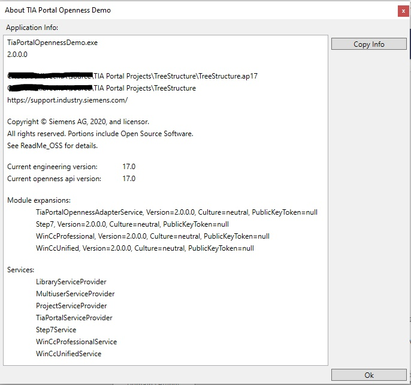{ #fig-6-53 }


表 6-22

| 编号 | 说明 |{ #table-6-22 }
|------|------|
| 1. | 运行时信息列表，如加载的工程和 Openness API 版本、加载的模块扩展，或 TIA Portal Openness Demo 应用程序的可用服务。 |
| 2. | 将运行时信息列表与整个跟踪日志一起复制到剪贴板。 |
| 3. | 关闭"关于"对话框。 |


